## Mar 9
###Programming Passing

``` python
def f (E1, E2, E3 .... En)  #agrs
call f (a1, a2, a3... an)   #parameter
```

1.  **Parameter correspondence**
    *   Positional correspondence
    *   varying #s of argument
    *   name correspondence

    * 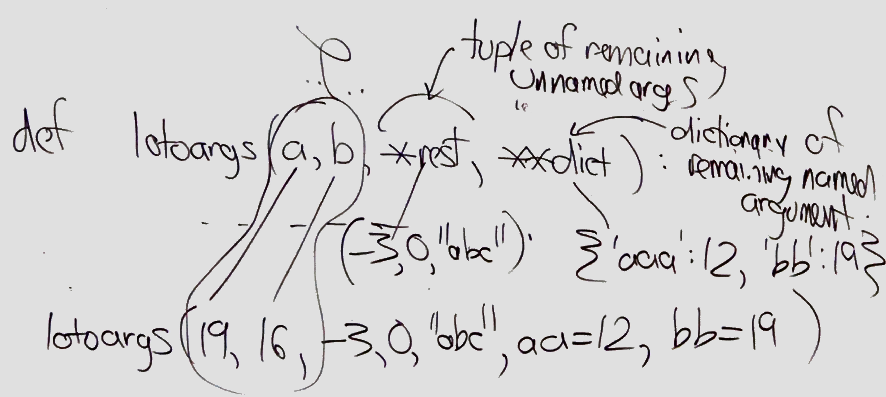
2. **Parameter passing conventions**
    *   **Call by value**:
        *   caller evaluate expressions
        *   passes copies(can be slow) of value to callee
            *   on the stack
            *   or in register
    *   **Call by reference**:
        *   caller evaluate *address* of expression
        *   pass *reference*(small) to callee <- fast
            * slows down passing of small values
        * ex: `f(a[i+7])`
            *   ```C
                int f(int &a){return a++;}
                int a[100] = ....;
                return f(a[i+7]);
                //-----------------------------
                int f(int *a){ return (*a)++;}
                int a[100] = ....;
                return f(&a[i+7])
                ```
        *   Aliasing issue -- confusing & slow code
            *   ```C
                void f(int &a, int &b)
                {
                    a+=5;
                    b*=2;
                }

                int a = ...;
                int x =a;
                f(x,x)  //error
                assert(x == a+5)
                ```
    *   **Call by result**:
        *   caller passes where to put results
        *   callee's responsibility to initialize parameters
        *   values copied to callers variables  
        *   ```Python
            v = f(x,y,z) #1 results, n args

            f(x,y,z, v, w)  #x,y,z are value args,
                            #v,w are result args
            v, w = f(x, y, z)   #equivalence to above
            ```
    *   **Call by value-result**
        *   when it call is call by value
        *   when it return the value, it call by result
    *   **Call by name (lazy evaluation)**
        *   caller passes a recipe for evaluating the expression to callee, callee can use recipe
         * 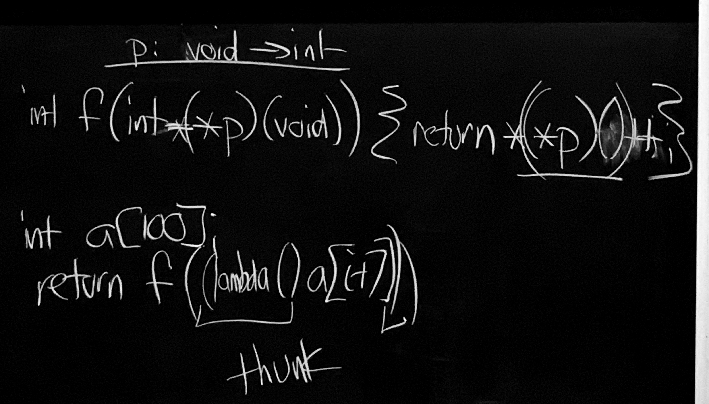
        *   ```Python
            printavg (n, sum/n) #call;
            def printavg(n, avg):   #defn
                if n == 0:
                    print "no items"
                else:
                    print "avg is", avg
            ```
    *   **Call by need**
        *   like cal by name
        *   but the thunk is evaluated at most once
        *   and the result cached
    *   **Call by unification**
        * prolog
    *   **Macro calls**
        *   evaluated at compile time
        
    
### Cost Model
*   O(n) vs. O(n^2) algorithms
    * big O value is important usually
    * what cost?
        *   time (CPU time / real time)
        *   space (memory)
        *   network access (throughput / latency)
        *   energy
1.  mental model of how things execute
    *   eg: `lists` in Lisp
        *   prepending is cheap `cons a b`<-`O(1)`
        *   appending is expensive `(append a b)` <- `O(n)`
        *   eg `(append l1 l2 l3)`
            *    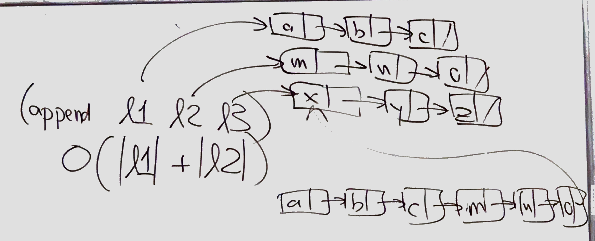
                *   `(append '(0 5) l)` is cheap
                *   `(append l '(0 5))` is expensive
    * in Python
        *    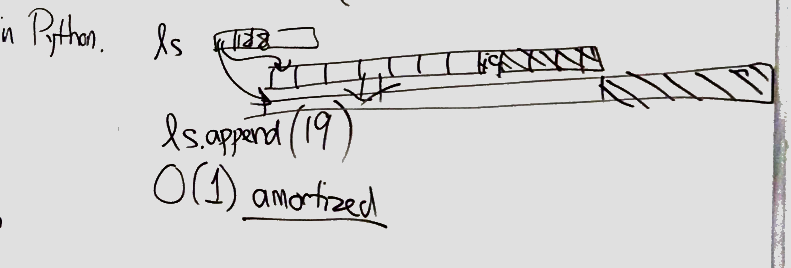
    
2.  measure


*   Cost of Comparison in Scheme 
    ``` Scheme
    (eq? a b)   <- pointer comparison
    (=  a b)    <- value of numbers comparison
    (eqv? a,b)  <- value of anything comparison
    (equal? a b)<- recursive comparison (ca be mistakenly run forever)
    ```                                                                    
*   Cost of calls   (assumes call by value)
    *   caller: 
        *   evaluate argument
        *   copy the values to parameters location (regs slots on stack)
        *   jump to procedure start, save return address
    *   callee:
        *   allocate frame
        *   save regs as need
        *   allocate body of callee
            *   copy result to return register
            *   deallocate frame
            *   jump back   
    *   How to optimize this?
        *   inlining (work very will while the function is small)
        *   tail call optimization 

*   Cost of array access
    *   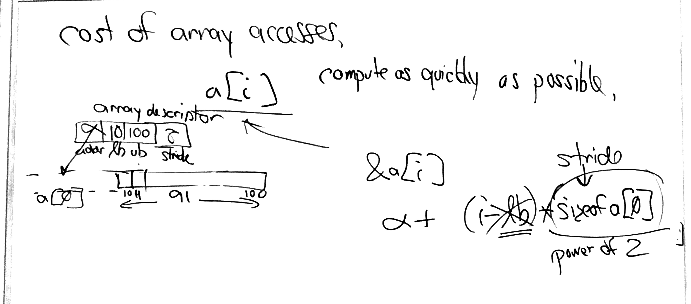
    *    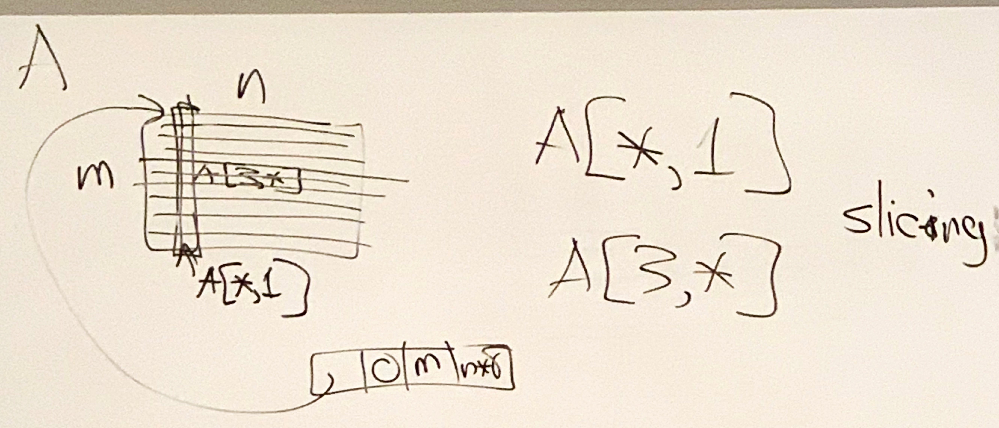

*   Cost of Prolog Unification
*    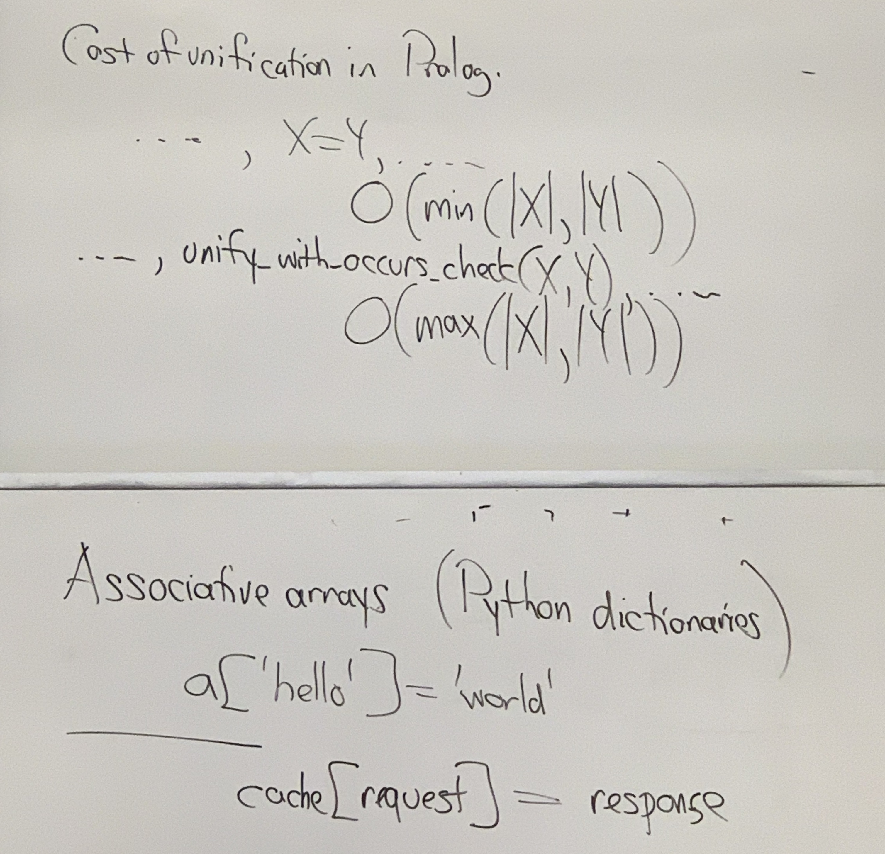
    

-----------------------
## Semantics
*   i.e. What does a program means?
*   compare semantic to syntax (this is easy)
*   **Static semantics and Dynamic semantics**
    *   Static --> compile times, linker,...
    *   Dynamic --> while running

### Static semantics
*   2 main problem
    *   **Type checking**
        *   (Dynamic in Python)
        *   typical language: C++, Java
    *   **Name Checking(scope Checking)**
        *   Dynamic in Lisp
* **How to specify?**
  * Replicate process of BNF
    * "we want BNF for type, scope rules"

*   **Attribute Grammars**
    *   BNF + attribute for each node in parse tree + attribute computation rules (how to compute attribute in particular parse tree)
    *   Ex: 
    *   
        *   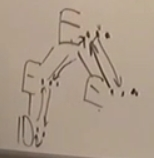 
        *    Type attribute: `int` & `float`
        *   
            ``` C
            //BNF
            E1->E2+E3
            E-> ID {type(E1) = lookup(ID, symtab(E1))}

            //this is a button-up architecture
            //this is a synthesized Attribute
            type(E1) = if type(E2) = int & type(E3) = int
                        then int
                        else float  

            //inherited architecture
            Symtab(E2) = symtab(E1) //symbol table
            symtab(E3) = symtab(E1)
            ```
        *   No loops in dependencies!!!!


### Dynamic semantics
*   | Language | Semantics |
    |------------|--------------|
    | Imperative | Operational |
    | Functional | denotational |
    | Logic | axiomatic |

*   **Logic Background**
    *   **Propositional logic**
        *   "For all ∀; There exists ∃"
        *   Ex1:
            *   p = "There are no in-person classes at UCLA today"
            *   q = "   The 405 is busy"
            *   **logical connectives**
                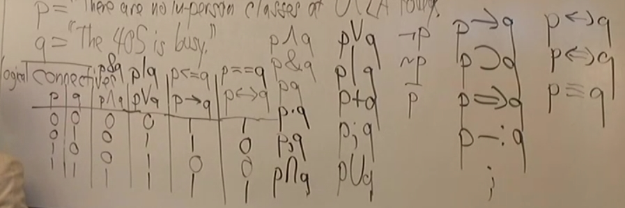 
                | p | q | p&q | p or q | p->q (p impies q) | p<->q (p implies q and q implies p) |
                |---|---|-----|--------|-------------------|-------------------------------------|
                |  |  |  | p | q | p <= q | p==q |
                | 0 | 0 | 0 | 0 | 1 | 1 |
                | 0 | 1 | 0 | 1 | 1 | 0 |
                | 1 | 0 | 0 | 1 | 0 | 0 |
                | 1 | 1 | 1 | 1 | 1 | 1 |
        *   Ex2:
            *   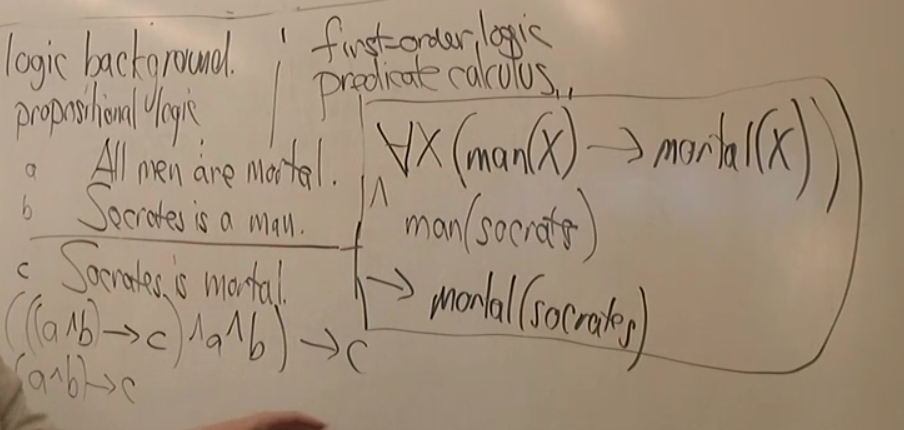 
        *   Always true(tautology)
            *   p -> p
            *   ((p->q)& (q->r)) -> p->r
            *   You can always prove or disprove any propositional logic(whether it is a tautology) 
            *   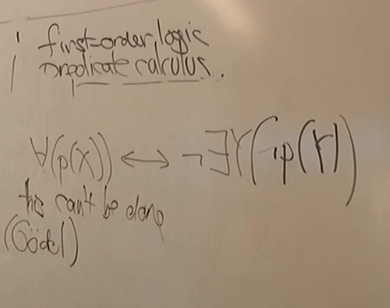 
    *   **Clausal form(normal form for predicate calculus)**
        *   Clausal form is a special form in predicate calculus
        *   Details --> AI class
        *    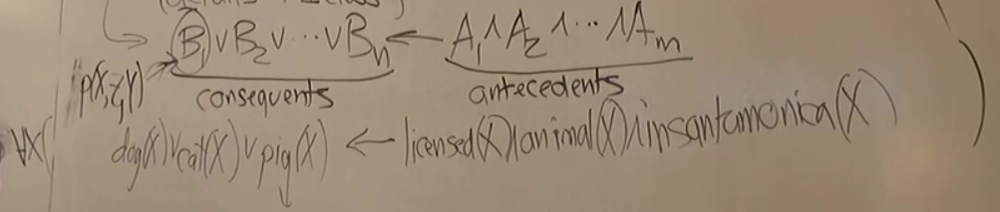 
    *   **Horn clauses: a sub set of Clausal form (when n <= 1)
        *   n = 1, m = 0    fact
        *   n = 1, m > 0    rule
        *   n = 0           query
        *   In prolog (always do prove by contradiction)
            *   `?- mortal(X)` equivalents to `∀X (false <- mortal(x))`


* **Operational Semantics of Java**
  *   Write a Java interpreter in Scheme
  *   Know a Java program's behavior by watching the Scheme interpreter run with it
  *    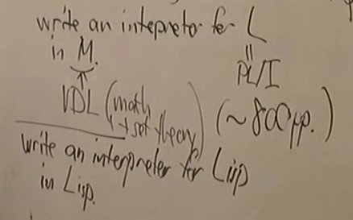 

*   Operational Semantics of basic ML
    *   write an ML interpreter in Prolog
    *   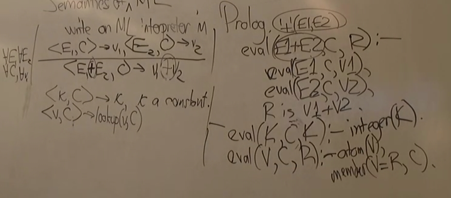 
    *   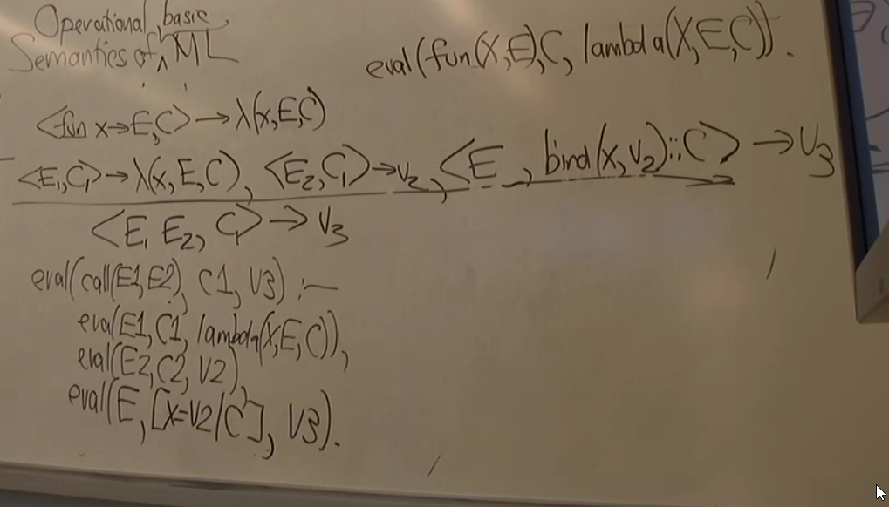 
*   Denotational Semantics 指称语义
*   Axiomatic Semantic 公理语义
    *   logical basis for imperative languages
    *   Assume no side effect in expression