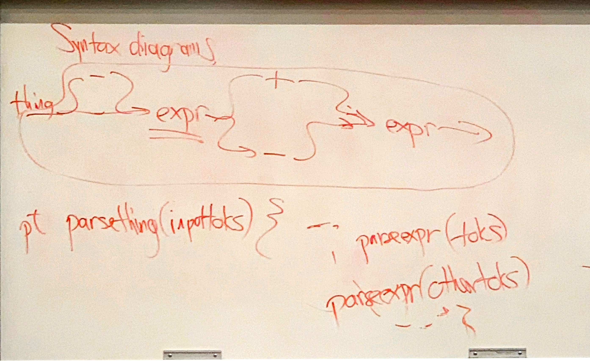
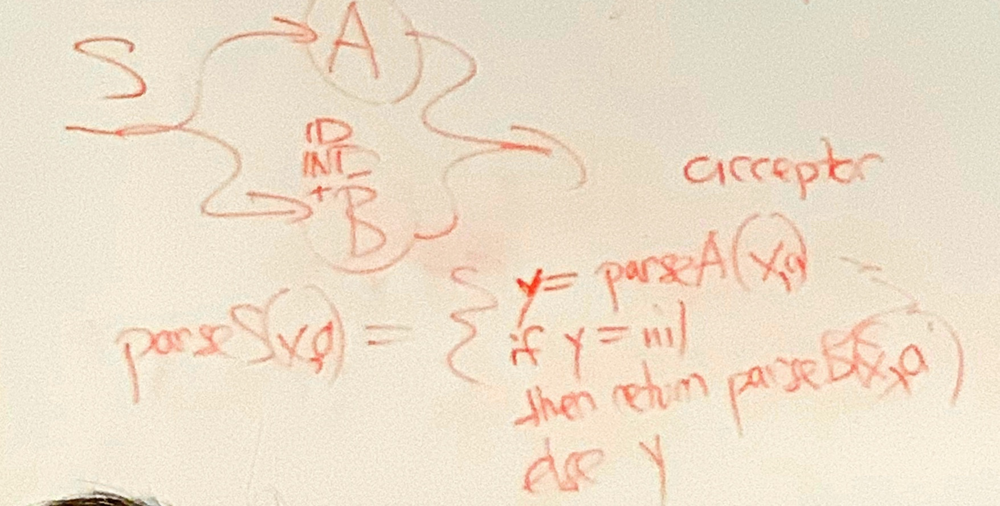

###Jan 22
#### Ocaml cont.
```Ocaml
    let a = a + 0 (*recursive*)

    let rec fact = function 
    | 0 -> 1
    | n -> n * fact (n-1)
    
    val fact : int -> int = <fun>
    --------------------------------

    let rec reverse = function
    | [] -> []
    | h::t -> (reverse t)@[h] (*"@" operator is low efficiency O(n), cuz we need to traverse entire list to create a new list*)
    
    val reverse : 'a list -> 'a list = <fun>

    # reverse [1;2;3;4;5];;
    - : int list = [5; 4; 3; 2; 1]

    # reverse [[1;2];[2;3];[3;4]];;
    - : int list list = [[3; 4]; [2; 3]; [1; 2]]
    -------------------------------

    let rec revapp l a = match l with
    | [] -> a
    | h::t -> revapp t (h::a) (*(h::a) act as a accumulator,"::"(cons) has O(1), we only traverse element h*)
    
    val revapp : 'a list -> 'a list -> 'a list = <fun>

    # revapp [5;9;2] [1;2;3];;
    - : int list = [2; 9; 5; 1; 2; 3]
    ---------------------------------
    let rec revapp a = function
    | [] -> a
    | h::t -> revapp t (h::a) 

    ------------------------
    let rec minimal = function
    | h::t -> let r = minimal t in 
                if h < r then h else r
    |[] -> 100000000 (*any extremely large number. for the case of empty list, 不严谨*)
    
    val minimal : int list -> int = <fun>
    
    let suminval = function
    | [] -> None
    | [h] -> Some h
    | h::t -> let s = minimal t in
                Some (if s < h then s else h)
    
    val suminval : int list -> int option = <fun>

    --------------------------------------
    let rec minvalD large_number = function
    | [] -> large_number
    | h1::t -> let r= minvalD h1 t in
    if large_number < r then large_number else r;;
    
    val minvalD : 'a -> 'a list -> 'a = <fun>

    let suminvalD = function
    | [] -> None
    | h::t -> Some (minvalD h t);;
    
    val suminvalD : 'a list -> 'a option = <fun>
    ----------------------------------------
    let rec minvalN op h = function
    | [] -> h
    | h1::t -> let r =(minvalN op h1 t) in
                        if op h r then h else r
    
    val minvalN : ('a -> 'a -> bool) -> 'a -> 'a list -> 'a = <fun>

    let suminvalN op = function
    | [] -> None
    | h::t -> Some (minvalN op h t)
    
    val suminvalN : ('a -> 'a -> bool) -> 'a list -> 'a option = <fun>

    let minval_in = suminvalN (<)
```

##### Accumulator
* "extra" arg to a recursive function that accumulates the part of the answer completed so far.

#### Discriminative union
```Ocaml
    type bintree = 
    | Leaf
    | Node of bintree * bintree

    let rec leafcont = function
    | Leaf -> 1
    | Node(a,b) -> (leafcont a) + (leafcont b)

    ---------------------
    (*custom type of option and list*)
    type 'a option = | Some of 'a | None
    type 'a list = | (::) of 'a * 'a list
                   | []
```

 * 
#### Parsing problem
* Recursion in the grammar
 
* Concatenation : S-> ABC
  * ``` parseS(x){y=praseA(x); z = praseB(y); return phraseC(z);} ```
  * ```parseS(x) {return (parseC(parseB(parseA(x))));}```
* Alternation(OR) S -> A|B|C (EBNF) (S->A or S->B or S->C)
  *  

```Ocaml
let rec make_OR_matcher = function
| [] -> (fun x -> None)
        (*h->pattern; t->list of pattern*)
| h::t ->  let mt = make_matcher t and mh = make_matcher h in 
    function frag accept -> 
    (match (mh frag accept) with
        | None ->(mt frag accept)
        | x -> x)
```
                