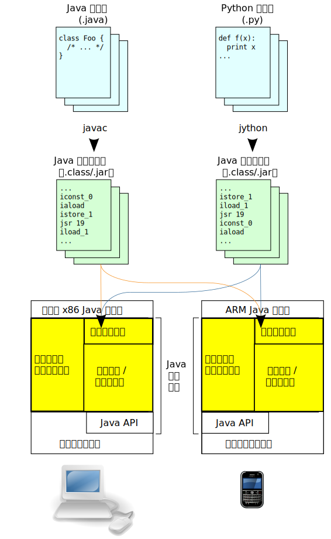
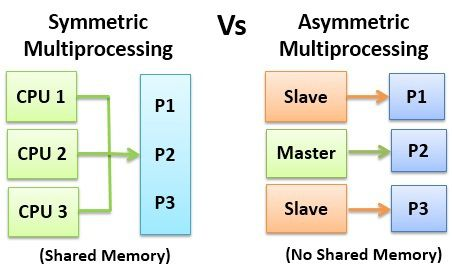
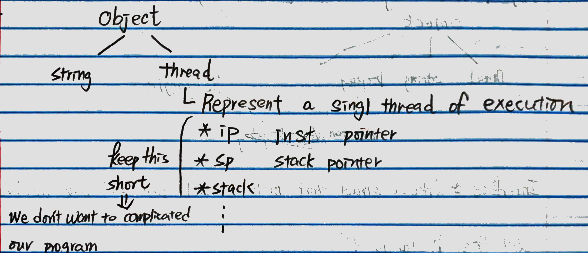
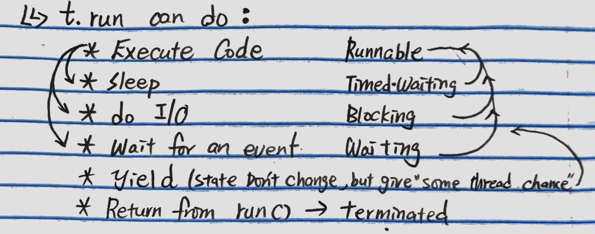
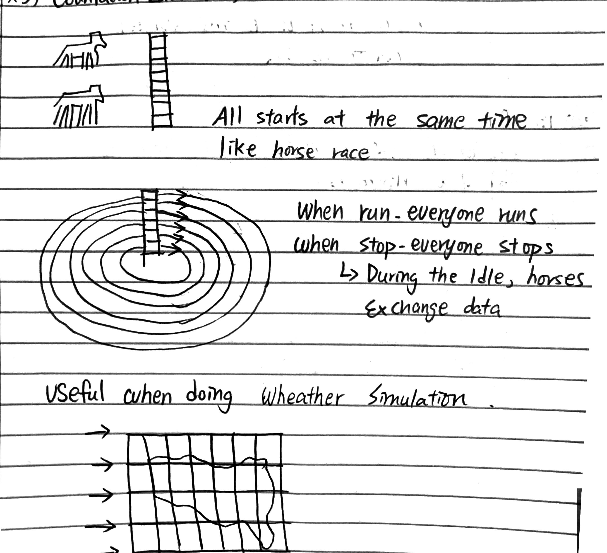
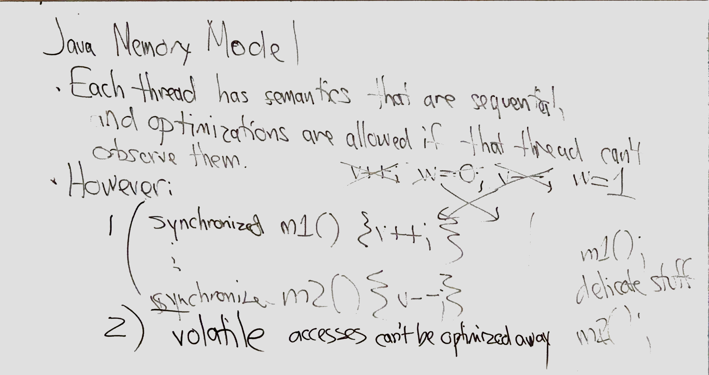
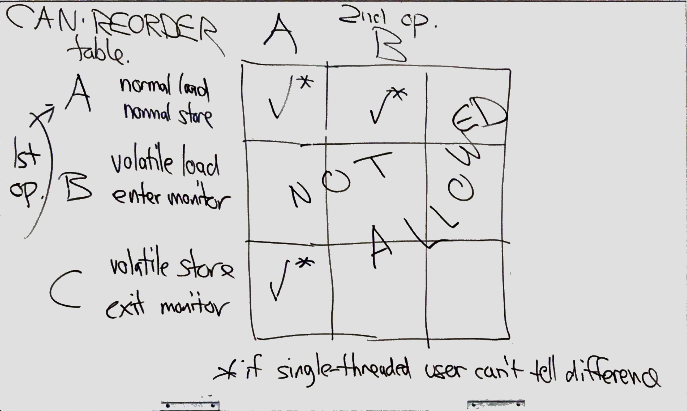

#### Jan 27
#### Week 4

##### World fastest computer?
* What's fastest? How to measure?
  * latency 
  * throughput
  * Benchmark -> linear programming matrices, scientific computing

* **Summit IBM Power9 CPUS**
  * Nvidia Votta 6V100s
  * **SIMD** (Single instruction, multiple data)
  * **MIMD** (Multiple instruction, multiple    data)
* **Motivation of super computer**:
  * Early 1990's Sum Microsystems thinking about future computing
  * Background: SunOS (Like Linux)
    * Networked computing
    * Internet
    * C Networking
    * Server
    * Looking forward to IoT
  * Problem C
  * **Thinking to switching to C++** : OS + app
    1. software is unreliable, subscript errors, bad pointer, free(p) then use p...
    2. multiple CPU architecture
    3. fat executable (big) -> (14kb/s)
 * In Xerox PARC, they invent a OOP language: **Smalltalk**
  * Side node 
      * Complier: translate the code to machine code, and execute machine code
      * Interpreter: very close to the source code "runs" thats.
      * The main difference is that an interpreter directly executes the instructions in the source programming language, while a compiler translates those instructions into efficient machine code
   * Smalltalk interpreted OO language, split their apps in 2 parts
     1. Smalltalk code
     2. [In interpreter] (interpreter code)
        1. Byte codes for an abstracted machine
        2. Interpreter language checks subscripts, printers

     * Dynamically typed 
 * IN UIUC, Mosaic(in C++) -> first successful browser
   * Problem: Crashes, Inflexible 
   * Solve: 
     1. Some people rewrite it in Java -> HotJava browser -> fewer crash, download byte code, flexible browser 
     2. Some people decided to fix it -> Mozilla -> Firefox


#### Source Code
* **normal routine**
  1. tokenization/ lexical analysis
  2. parsing
  3. type checking (static type checking language only)
  4. generate IR (intermediate representation)
  5. Optimize
  -----^Some for all complier^--v machine dependent v--
  1. generate assemble language code(difference by architecture) by complier 
  2. generate object file (relocatable format machine code that is usually not directly executable) by assembler
  3. executable file by linker (linker library object file)
  4. load to RAM and run

 * **byte code version**
    * output IR as byte codes
    * ex in java
      1. source code: ```foo.java```
      2. ```foo.java``` compiled by complier ```javac``` -> ```foo.class``` (java byte code) 
      3. ```foo.class``` run(execute) on ```JVM (java visual machine)``` by using **interpreter**
  *  advantage: JVM(HotSpot by Oracle) has a histogram (**java interpreter map**) of which parts of code are used more frequently.
     *  check during running, keep the more frequently one in the cache
  *  

* Interpreter is easy to write, easy to maintain, easy to debug in interpreter, downside: performance.
#### JVM
* The JVM must be platform dependent to allow your Java to run on the specific platform. A JVM for Windows will translate your Java into different system calls than a JVM for OS X.
* Run bytecode generated by a java complier
* Provides separation of code and operating system / hardware
  * Write once, run everywhere
* JVM provides Just-in-time compilation (JIT), garbage collection, ...

-------------------
#### Java
* Java is **strongly typed**
  * Unlike C, C++ you cannot use cast to check
    * ```T(E)``` checked at runtime
* Has runtime check for 
  1. ```p.x``` error if ```p``` is ```null```
  2. ```a[i]``` error if ```i < 0 | i > a.size```
* **Primitive type**: byte(8); short(16); int(32); long(64); float; double; char; Boolean
* **Reference type**: reference **object** by using **pointer** 
  * Array is a reference type object
   ``` Java
   float[] a = .... //in here float[] length is a dynamic property, not part of type
    a.length; // fixed once created, you can create array from method, created on the heap.
   ```
* **Object in Java**
  * arrays
  * classes
    *  like C++
       * you have: ```Inheritance, instance vars, method, constructor```
       * But no ```multiple inheritance, templates (but generics)```(which is exist in C++)
  * a method can shadow a superclasses' method
  * An instance var can shadow a superclasses' instance var
  * In java, instead of having multiple parents(become a subclass of others), but it can **implement** an **interfaces** to use its method.
    ```Java
    class rectangularDisplay extends Display implement Rectangle 
    //Display is parent class, rectangle is a interface
    //Thus, the children of rectangularDisplay can only use the code from display but not Rectangle.
    ``` 
  * Interface:
    *  a completely "abstract type" that is used to group related methods with empty bodies
    *  Only have define the method, but no implementation
    *  Can’t be instantiated, a class must implement it
    ```Java
    // interface
    interface Animal {
      public void animalSound(); // interface method (does not have a body)
      public void run(); // interface method (does not have a body)
    }
    ```  
  * abstract class 
    * Combination of a class and an interface
    *  Classes can extend only one abstract or normal class
  ```java
  abstract class People{    // 定义一个抽象类
      private String name;  // 实例变量

      // 共有的 setter 和 getter 方法
      public void setName(String name){ 
          this.name = name;}
      public String getName(){
          return this.name;}
      
      public abstract void intro(); // 抽象方法
  }
  class Teacher extends People{
      public void intro(){ // 必须实现该方法
          out.println("I'm teacher " + this.getName());
      }
  }
  class Driver extends People{
      // 必须实现该方法
      public void intro(){
          out.println("I'm driver " + this.getName());
      }
  }
  ``` 
  * final class
    ```java
    final class People{
      public People(){}
    }
    class Man extends people{} //this is invalid
    ``` 

* Access modifiers
  * Controlling who can access object's methods/fields
  * 
    | Modifier/Access Level | Class | Package | Subclass | World |
    |-----------------------|-------|---------|----------|-------|
    | public | Y | Y | Y | Y |
    | Protected | Y | Y | Y | N |
    | no modifier | Y | Y | N | N |
    | private | Y | N | N | N |
  * classes have only two access modifiers: public or no modifier("package private")
  * You **cannot degrade** the access level of interface's methods.


----------------------------------
#### Jan 29
#### Java and threads
  * ##### Background
    * SMP (symmetric multiprocessing)
    * 
    * Multi-threading computation
    * each thead execute independently
    * embarrassing parallelism
      * each tread communicate with their own part of resource (even though they are using one main big resource)
      * easy to implement
    * concurrency controlled parallelism
      * require discipline by programmer!
      * Concurrent programs can use either processes or threads
        * Processes have their own memory space, threads share the memory space within one process

  * #### In java
    * 


  * ##### Thread's life cycle
    * 
      ```Java 
      //create in via ```new```               Do          | Resulting state
      var t = new Thread()  //allocate OS thread resource | NEW
      t.start()             //OS can choose to run or not | Runnable
                            //invokes t.run()      
      ```
      
    * two way to define a thread
      1. **Subclassing**
        ```Java
        class HW3thread extend thread{
          public void run()
        ///...
        }
        // Object |
        // Thread |
        // HW3Thread | (the Thread cannot be parallel with HW3Thread)        
        ```  
      2. **Delegation (more popular)**
        ```Java
        class HW3thread implement Runnable{
          public void run()
          //...
        }
        var hw3 = new HW3Thread()
        var t = new Thread(hw3)
        hw3.start(); t.start();
        hw3.join(); t.join(); //wait for thread hw3 and t to finish
        // HW3Thread | Thread (they are parallel)
        ``` 

  * **Race condition**:
     ```Java
    //Problem demo
      Class simple{
        Private int val;
        Public void bump() {val++}; 
        //val ++ is equivalent to : (temp = val + 1; val = temp;) this will has race condition
        Public int getVal() {return val};
      }
    // Solve by Synchronized methods (lock)
      Public void bump() {self.lock(); val++; self.unlock()} 
    ```  
    
   * (Solve) **Synchronized methods**
     * **using lock**
       *  ```self.lock()```and``` self.unlock()```
       * avoid race condition by **sacrificing performance** (Performance bottleneck)
       * Only one thread can access the object at the same time
     * **Lock with Wait and notify**
       * ```Obj``` ->any object
       * ```Obj.wait()``` 
         1. remove all locks hold by this thread
         2. thread waits(waiting) until ```Obj``` become available
       * ```Obj.notify()```
         * wakes up one of the waiting threads (chosen by OS) 
       * ```Obj.notifyAll()```
         * wakes up one of the waiting threads (chosen by the programmer)
     * **```Synchronized``` keyword**
       * Each object has a lock
       * Exclusive access
         * only one thread can enter any synchronized method in one object at one once
       * ```Happens-before``` relationship
         * everything that one thread did while in a synchronized block will be visible to the next thread entering a synchronized block
         * A thread can call any other synchronized method while it holds the lock (**death lock**)
        ```Java
        public class SynchronizedCounter{
          private int c = 0;
          public synchronized void increment(){c++;}
          public synchronized void decrement(){c--;}
          public synchronized int value() {return c;}
        }
        ``` 
       * synchronized can also be used for smaller blocks of code, avoid blocking other threads when it is not necessary
       *  ```synchronized``` block can use any object as lock
        ```java
        public class SynchronizedCounter{
          private int c = 0;
          public void incrementAndWork(){
            //computation here ....
            synchronized(this){c++;}
            //computation here ...
          }
          private Object mylock = new Object();
          public void decrement(){ synchronized(mylock) {c--}; }
        }
        ```
   * **Other synchronization approaches**
     1. **Semaphores**
        ``` Java
        s.acquire()     //get a permit, waits until available
        s.Tryacquire()   //no waiting, fail if not available
        s.release()     //give a permit
        ```  
      1. **Exchanger**
          ```Java
          v2 = e.exchange(v1) //T1
          v1 = e.exchange(v2) //T2
          //v1 v2 are objects
          ``` 
      2. **CountdownLatch()**
          
  --
  * **Non synchronization approach**
    1. **```Volatile```keyword**
         * Defining variables volatile guarantees that other threads will see the changes immediately
           * use CPU memory barriers
         * Without ```voliate``` there is no guarantee that thread are not using their locally cached version of variables
         ``` java
         public class Shared Object{ public volatile in counter = 0}
         ```
         * Volatile access can not be reordered relative to other reads/writes
         * If two threads access the same volatile variable, the second thread is guaranteed to see the same state as the first thread
         * Volatile does not prevent our earlier problem where two threads tried to perform counter++ simultaneously!
           * No locks used -> **Reads and writes** can still happen simultaneously
         -- 
    2. **```java.util.concurrent.atomic``` class**
       * ```java.util.concurrent.atomic.AtomicIntegerArray```
       * Atomic package provides data types with atomic operations
       * Atomic = Other threads do not see intermediate states, only the final state
        * AtomicLongArray provides an array with atomic/volatile operations
        * Calling get/set on individual elements is **volatile**
        * Calling incrementAndGet and similar methods is **atomic**
        * For example, AtomicInteger can be used to perform cnt++ as an atomic operation:
         * ```Java
            AtomicInteger cnt = new AtomicInteger(5)
            cnt.set(10);  //volatile
            cnt.incrementAndGet();  //atomic
            cnt.get();  //volatile
            ``` 
  -- 
* **Optimization + JMM(java memory model)**
  ```java
  int v, w    //movl v,   %eax
  v++         //movl w,   %edx
  w--         //addl $1,  %eax
              //subl $1,  %edx
              //movl %eax, w
              //movl %edx, v
  ```
  * ILP (instruction level parallelism)
  * In Single-Thread: observer looks a code at the java level, not via intervals.
 
* **Java Memory Model**
    * 
    * define how thread interact through memory
      * i.e. How multithreaded programs can behave in different situations
    * **As-if-serial, aka As-if rule** semantics used within one thread
      * Compiler can change your code in any way as long as the result of execution is the same
      * E.g. y = 1; x = 2; vs x = 2; y = 1;
    * With multiple threads things more complicated -> needs your input
      * Java provides multiple ways to set constraints on the order of execution
  ----------
  * Each thread has semantics that are sequential, and optimization are allowed if that thread cannot observe them.
    * ex: in the case of ```v++; w=0; v--; w=1``` cannot be optimized 
    
  * **Can Reorder Table**
    *    

#### CPU Caches 
* multiple levels of caches
  * each CPU/core can have their own cached values
  * Even if everything happens in the expected order, result can be incorrect.
  *      
  * which will cause race condition in jvm.
    * a thread is operating on a old value, instead of a new value return from another thread