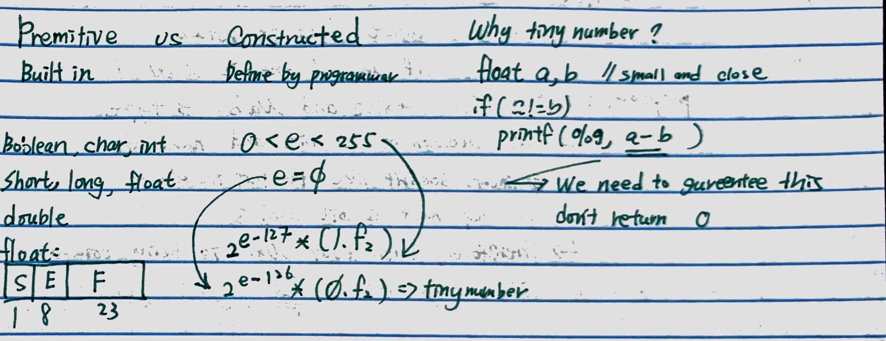
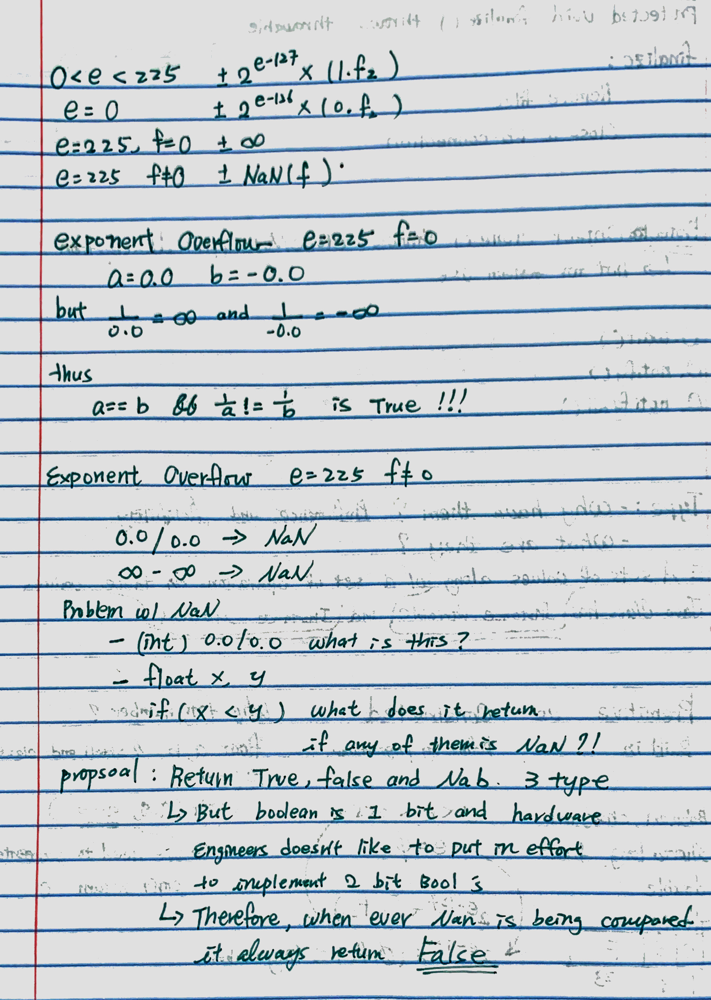
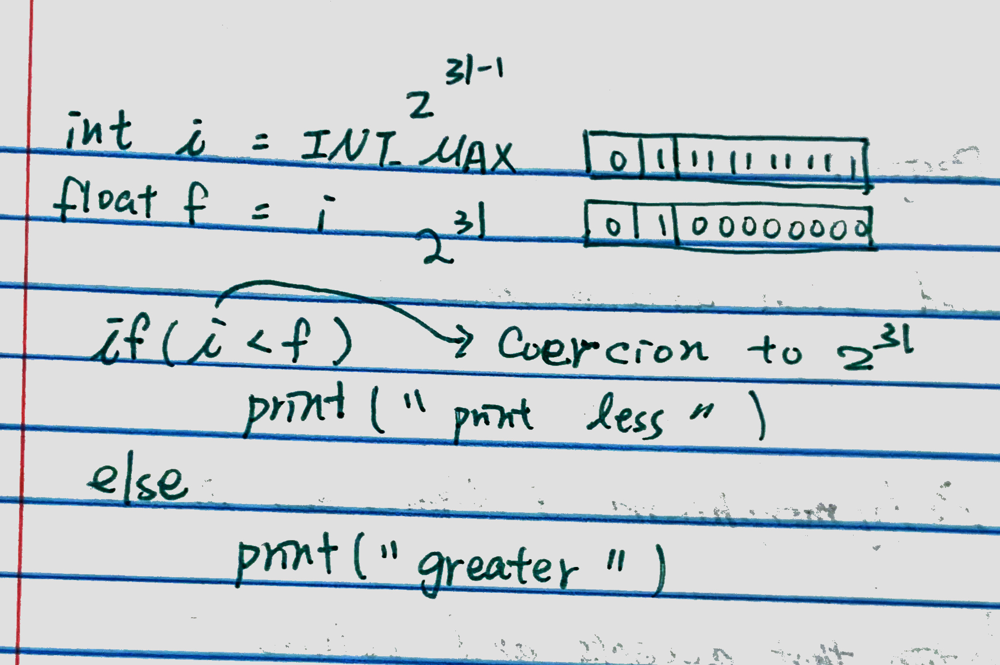

#### Feb 3
#### Java Class
  ```Java
  Public class Object{
    public Object();
    public int hashCode();
      //- default:(int)0
      //It returns the hashcode value as an Integer.
      //在一个Java应用的执行期间，如果一个对象提供给equals做比较的信息没有被修改的话，该对象多次调用hashCode()方法，该方法必须始终如一返回同一个integer。
      //This method must be overridden in every class which overrides equals() method.
      //Equal objects must produce the same hash code as long as they are equal, however unequal objects need not produce distinct hash codes.
    public boolean equal (Object obj);
      //Shadow comparison: this == obj,
      //this compare if two objects' memory location is equal. comparing if two reference is same
      //but it doesn't compare the contents inside the class, so sometime we need to rewrite it.
      //Deep Comparison: or we can do: this.hashCode() == obj.hashCode()
      // - default:==
    public String toString(); //for debugging(advisory)
    public final Class getClass();// return class type
    protected void finalize();
      //work as destructor
      //unlike c/c++, there are nothing to "free", java will do the garbage collection by itself
      //but we still need the destructor to deal with the resources that outside the scope of garbage collection
      //terminate the connection to the database, such as close the file
    protected Object clone() throws 
      ClassNotSupportedException();
      //shadow copy by default
      // we use protected because we don't want it be called from outside of the class(don't like us to destruct ourself)

  }


  var o = new Object();
  var o1 = new Object();
  o.hashCode;
  o.equals(o1); 
  o.getClass();//return Object
  o.clone();
  ```
  * **Shallow comparison**: The default implementation of equals method is defined in ```Java.lang.Object``` class which simply checks ****if two Object references (say x and y) refer to the same Object**. i.e. It checks if x == y. Since Object class has ****no data members that define its state**, it is also known as shallow comparison.
  * **Deep Comparison**: Suppose a class provides its own implementation of equals() method in order to compare the Objects of that class **w.r.t state of the Objects**. That means data members (i.e. fields) of Objects are to be compared with one another. Such Comparison based on data members is known as deep comparison.  
  Some principles of equals() method of Object class : If some other object is equal to a given object, then it follows these rules:

  * **Reflexive**: for any reference value a, a.equals(a) should return true.
  * **Symmetric**: for any reference values a and b, if a.equals(b) should return true then b.equals(a) must return true.
  * **Transitive**: for any reference values a, b, and c, if a.equals(b) returns true and b.equals(c) returns true, then a.equals(c) should return true.
  * **Consistent**: for any reference values a and b, multiple invocations of a.equals(b) consistently return true or consistently return false, provided no information used in equals comparisons on the object is modified.
  * **Note**: For any non-null reference value a, a.equals(null) should return false.
  --
  * Recap: In Java, Object can be: 1.**String** 2.**Thread** 3.**Class**
  * **Class** describes a java class: ex: ```Class c = ...; c.toString();```
  * **reflection** -- "self-aware" program
  * **singleton pattern**: a class that has exactly one member


#### Type
    * why hare them? -> performance, reliability
    * what are they?

  * Type: a set of values along with a set of operations on those values
  * Java class has:
    1. instance variables
    2. instance methods
  * **primitive type vs constructive type**
    * **primitive type**: predefined type:
      * boolean, char, short, int, long, float, double...
      * string is **not** a primitive type
      * **float**
        *  
        *  
        * exponent overflow阶码溢出-> $\infty$
        * 0.0/0.0 -> ```NaN```
        * $\infty$ - $\infty$ = ```NaN```
        * when we compare ```NaN``` to anything, it will return false
          * even ```(NaN == NaN) = false```
        * "why java use the especial value like ```NaN``` and $\infty$ instead of exception handler?"
          * in FORTRAN age, they use especial value when they building the hardware

        * 0.0 == - 0.0 --> a == b && 1/a != 1/b
 

    * **constructive type**: defined by programmer
      * when we designing our own type, we must consider about the equal operation and other common operation (ex: +, -)
  * **3 main uses of types**
    1. **annotations** --useful info for reader(human complier)
    2. **inference** - ```(float)a + (int)b * (long)c = (float)```
    3. **checking** 
        1. **Static** - by complier, before execution (OCaml ,Java, C/C++) (except casts)
        2. **Dynamic** - during execution (Python, Lisp)
        * strongly typed - you can't cheat types

  * **Abstract type vs. Exposed type**
    * **Abstract**: keep implementation "secret"
    * **exposed**: users "know" implementation
      * ```struct complex {double re; double im;};```
        * -: tight coupling between use & implementation
        * +: efficiency

  * **Type equivalence**
    1. **structural equivalence**: type are same if underling data structures are same (C/C++)
        ``` C++
        typedef long s;
        typedef long t;

        struct l {int val; struct m* next;};
        struct m {int val; struct l* name;};
        l = m; //valid
        ```

     2. **name equivalence**: type are same if they have the same name
        ```C++
        class s{double re,im;};
        class t{double re,im;};
        //same in Java (although java has no sturct, but it has class)
        typedef struct {int data[100]; int count;} Stack;
        typedef struct { int data[100]; int count; } Set;
        Stack x, y; Set r, s;
        x = y; r =s; //valid
        x = r; //invalid, would not be accepted by a translator
        ```
     * C/C++ use structural equivalent except for structs and classes(where name equivalence is used). For arrays, size is ignored.
     * Java uses structural equivalence for scalars. For arrays, it requires name equivalence for the component type, ignoring size. 
       * For classes it uses name equivalence except that a subtype may be used where a parent type is expected
         * ```java
            void foo(Object O){...};
            foo (new Integer(100)); //valid, since Integer is a subclass of Object.
            ``` 
  * **Subtype**
      * T is subtype of U
        1. T's value are a subset of U's value
        2. U's ops are subset of T's ops
      
        ```Java
          U a; T b;
          a = b; //OK if T is subtype of U
        ```
    * Q1: Does ```short``` is a subtype of ```int``` in C? --> No
      ```C
      int *p; short s; p = &s; // exception, this is not allowed
      ```
    * Q2: 
    ```C
      char* vs. char* const //in C,  char const * is not a subtype of char *
    ```
------------
#### Feb 5
#### Types continued
##### Polymorphism, Names & Bindings
  * a function that accepts and returns many different type is **polymorphic**
    * FORTRAN
    ```Fortran
    cos: float -> float <- 32 IEEE-754
    cos: double -> double <- 64 IEEE-754 //(Overloading + coercion): ad hoc polymorphism
    ```
    * Traditional C
    ``` C
    cos: double -> double
    cosf: float -> float

    float f = 1.5; 
    float g= cos(f) //this might have error
    // it cast f to double, then apply the cosine function to get double result, then cast it to float for g
    // float -> double is okay, but double -> float will have rounding error, lost precision
    
    double x = 3.14;
    double y = x + 1 //1 is converted from int to double -> coercion!!

    +:  int * int -> int //ad hoc polymorphism
        unsigned * unsigned -> unsigned
        float * float -> float
        double * double -> double 
        ...
        unsigned * long -> long //unsigned(int) 32 bits, long 64 bits
                                //c pick the type with the wider
        unsigned long * long -> unsigned long //unsigned long and long are bot 64 bits
                                              //c pick the first one
        
    int m = -1; unsigned n = 1057;
    if(n > m) print("ok"); // there will be no result, it will be never get called, and the compiler won't even generate the machine code for it
    //n and m has the same len 32, but unsigned is first,  so m will be cast to unsigned
    //(int)-1 -> (unsigned)INT_MAX, larger than (unsigned)1057 

    >:  unsigned * unsigned -> bool //ad hoc polymorphism
        int * int -> bool
        unsigned * int -> unsigned 
    ```
   *  
  * 特定多态（ad hoc polymorphism）是程序设计语言的一种多态，多态函数有多个不同的实现，依赖于其实参而调用相应版本的函数。因此，特设多态仅支持有限数量的不同类型。函数重载乃至运算符重载也是特设多态的一种。

  #### User-defined type in OOP
  * **Parametric polymorphism**
      * a function's type contains type variables
      * 参数多态在程序设计语言与类型论中是指声明与定义函数、复合类型、变量时不指定其具体的类型，而把这部分类型作为参数使用，使得该定义对各种具体类型都适用。参数化多态使得语言更具表达力，同时保持了完全的静态类型安全。

    ```Java
    public interface List{
      void add(Object a);
      Iterator iterator();
      ....
    }
    public interface Iterator{
      Object next ();
      void remove ();
      bool hasNext();
    }


    List l = list of string 
    for (Iterator i = l.iterator(); i.hasNext();){
      //remove the string with length 1
      //i.next() return a Object, but length() is a function of String, so we need to cast it
      if((String)i.next().length()==1)
        i.remove(); 
    }
    ```

    * **Java Generics (泛形) give you parametric polymorphism**
    ```Java
    public interface List <T> { // T is any interface type 
      void add(T a);
      Iterator <T> iterator();
      ....
    }
    public interface Iterator <T>{
      <T> next ();
      void remove ();
      bool hasNext();
    }

    List <String> l = list of string
    for (Iterator <String> i = l.iterator(); i.hasNext();){
      if(i.next().length()==1)
        i.remove();
    }
    ```

    ```Java
    interface Collection <T>{
    }
    void printALl (Collection <?> c){ //? is a wildcard, like '_' in Ocaml
      for (i : c)
        System.out.println(i)
    }

    Collection<String> cs = ...;
    printAll(cs);
    ```

    ```Java
    x = string [];  //list of string
    y = Collection <Object>;  //collection of object

    Static<T,U> void convert (T[] a, Collection <U> c){
      for (T i: a)
        c.add(i); //adding T to collection of U.
         //i is type T, c is collection of U, if T isn't a subtype of U, then this add is invalid.
    }
    convert(x,y); // this wont work, we cannot add string in to collection of Object
    -----------------
    Static<T extends U, U> void convert (T[] a, Collection <U> c){...}
    convert(x,y); //now this is okay, T is a subtype of U.
    -----------------
    Static<T> void convert(T[] a, collection <? super T> c)// or <? extends U>
    {...}
    convert(x,y); //also work
    ```

  #### Duck typing (type checking)
  * does the current object support ```o.waddle()``` and ```o.quack()```?
    * If yes, then it's a duck.
  * Dynamically-typed languages do this. (eg. Python)

  #### Implementation of polymorphic types
  * **Generics** (Java, Ocaml,...)
    * Typecheck generic method once, compile it once.
    * 泛型本质上是提供类型的"类型参数"，它们也被称为参数化类型（parameterized type）或参量多态（parametric polymorphism,将类型当作参数传递给一个类或者是方法。
    * Java 语言中的泛型不能接受基本类型作为类型参数――它只能接受引用类型。这意味着可以定义 ```List<Integer>```，但是不可以定义 ```List<int>```。
    *  Java 中的泛型则以不同的方式实现，编译器仅仅对这些类型参数进行擦除和替换。类型 ```ArrayList<Integer>``` 和```ArrayList<String>``` 的对象共享相同的类，并且只存在一个 ArrayList 类。
       * ```java
          List<String> l1 = new ArrayList<String>();
          List<Integer> l2 = new ArrayList<Integer>();
          System.out.println(l1.getClass() == l2.getClass()); //true
          ``` 
    *  而java则不存在“模板代码膨胀”这个问题的困扰。java中虚拟机中没有泛型，只有基本类型和类类型，泛型会被擦除，一般会修改为Object，如果有限制，例如 T extends Comparable,则会被修改为Comparable。
  * **Templates** (C++, Ada,...)
    * Typecheck templated method when it's instantiate
    * 在 C++ 模板中，编译器使用提供的类型参数来扩充模板，因此，为 ```List<A>``` 生成的 C++ 代码不同于为 ```List<B>``` 生成的代码，```List<A>``` 和 ```List<B>``` 实际上是两个不同的类。
    * 在c++中存在为每个模板的实例化产生不同的类型，这一现象被称为“模板代码膨胀”
    * 在C++中不能对模板参数的类型加以限制，如果程序员用一个不适当的类型实例化一个模板，将会在模板代码中报告一个错误信息。
  --
  * Implementing generics via erasure

