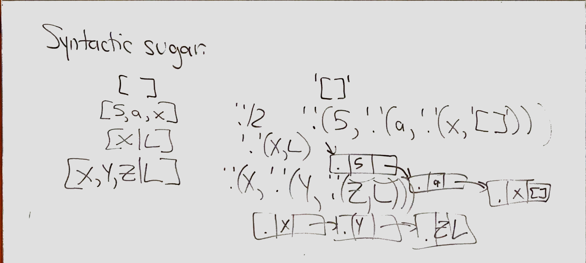
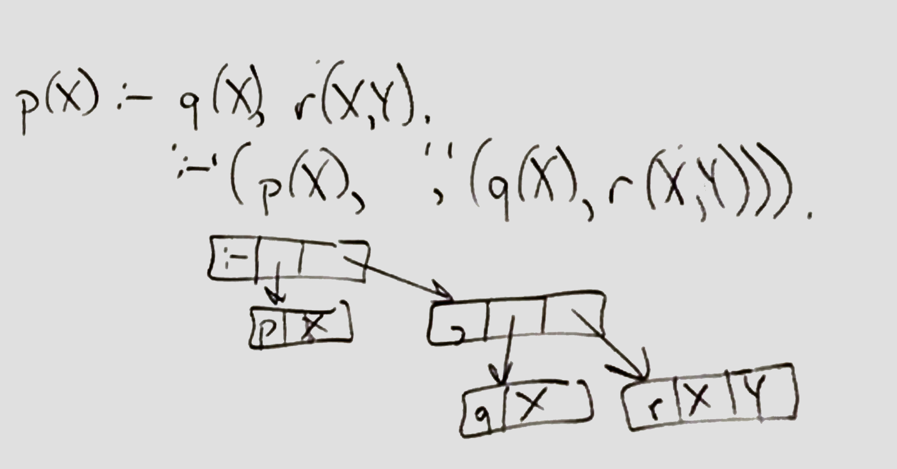
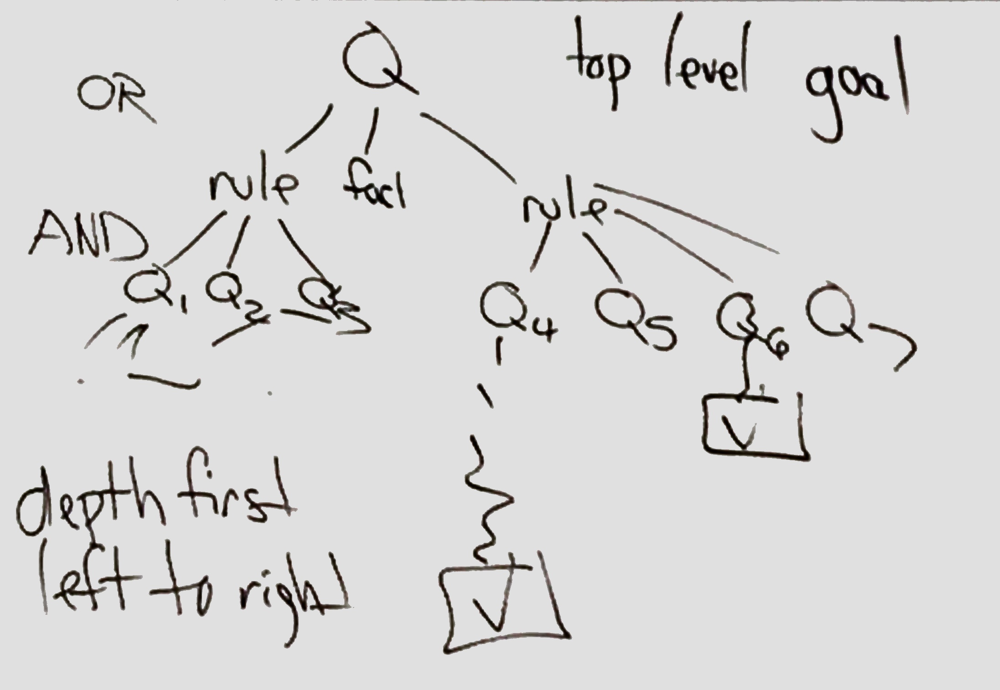
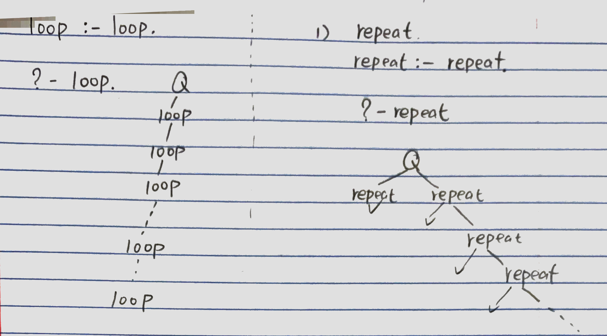

# Feb 12

## Logic programming & Prolog

| Type | language | special | Threads + |
|  ---  |  ---  |  ---  |  ---  |
| imperative | Java | commands | sequencing |
| functional | OCaml | expressions | calls |
| logic | Prolog | predicates | &, \|, etc (logical connectives) |

### [Prolog](https://www.metalevel.at/prolog/concepts)

* **Algorithm = Logic(correctness) + Control(efficiency)**

* ***Predicate***
    * Each **predicate** has a name, and zero or more arguments. The predicate name is a **Prolog atom**. Each argument is an arbitrary Prolog term. 
* ***Predicate Indicator***
    * A predicate with name ```Pred``` and ```N``` arguments is denoted by **```Pred/N```**, which is called a **predicate indicator**. ```N``` is called **the arity of the predicate**.
* ***Clause***
    *  A **clause** is either a **rule** or a ***fact***. The clauses that constitute a predicate denote logical alternatives: **If any clause is true, then the whole predicate is true.**
* ***Rule***
    *  A Prolog rule has the form: ```Head :- Body.```
    * The notation of the head of a rule depends on the number of arguments:
        1. If the predicate has zero arguments, then the head consists only of the predicate name.
        2. If a predicate called ```Name``` has a positive number N of arguments, then the head is written as: ```Name(Arg1, Arg2, ..., ArgN)```.
  * The **body** of each rule is a Prolog *goal(query)*.
    * A **goal** is a Prolog term that denotes a predicate and its arguments.
    * A rule is called **recursive** if one of its goals refers to the predicate that the rule is defining.
* ***Fact***
    * A **Fact** is written as: ```Head.```
    * This is equivalent to the rule: ```Head :- true.```
    * Logically, this means that the rule ***always holds***, because the built-in predicate ```true/0``` is always true.


* ```Prolog
    % sort/2
    sort(L,S) :- sameelts(L,S), sorted(S).
    % this is a rule, and also a clause
    % clause: a unit of info in a prolog programming ending with a full stop (".").
    %  ":-" means "IF"; "," means "AND", ";" means "OR"

    % sorted/1
    sorted([]). % a fact
    sorted([_]).
    sorted([X,Y|L]) :- X =< Y,  sorted(Y|L). % a rule
    % [X,Y|L] represents a list, first two elements are X and Y, and L are the rest elements(could be empty)

    % sameelts/2
    sameelts([],[]).
    sameelts([X],[X]).
    sameelts([X,Y][X,Y]).
    sameelts([X,Y][Y,X]).
    ....
    sameelts([X|L],R) :-
        sameelts(L,P), append(P1,P2,P), append(P1,(X|L),R)

    % append/3
    append([],L,L).
    append([X|L],M,[X|LM]):-append(L,M,LM).

    % query
    ?- sort([3,9,-5],R).
    R=[-5,3,9] % program output


    (infinite loop)
    loop:-loop. % loop is true iff loop is true
  ```  

### Prolog syntax

* **Terms**
    1. **number**
        * ex:2, 2e-9
    2. **Atom (Symbol)**
        * ex: e5_AB, 'ABC', '+', '0''clock'
    3. **(logical) Variable**
        * A, Aa, A1_29, _ABC (Not advice to use "\_", because the program will add "\_" for any variable(system generated))

* **Syntax sugar**
  * 
  *
  * 
  
* **How to do 2+2 ?**

 ```Prolog
    ?-2+2. % won't compile
    ?-'+'(2,2). % Not a query still

    ?-N=2+2.
    ?- '=' (N, '+'(2,2)). % equivalent
    N=2+2 % output

    ?-N is 2+2. % "is"'s 2nd arg must be a ground term, cannot be a logical variable
    N=4 % output 


 ``` 

* **3 kinds of clauses**
    1. **facts**
    ```Prolog
        prereq(cs35L,cs131).
        prereq(phi101,_). % phi101 is a prereq of anything
    ```
    2. **rules**
    ```Prolog
        tcprereq(A,Z):-prereq(A,B),tcprereq(B,Z).
        % before ":-" -> head
        % after ":-" -> body
    ```
    3. **quires(goal)**
        ```Prolog
            ?-prereq(X,cs131). % which class is a prereq of cs131?
            X = cs35L;
            X = phil101 % output
        ```
    * facts and rules can be treats as program; quires is how to do it.

    * You give interpreter a query ```Q```.
        * ```H``` look through programming in order, looking for either a **fact** that matches ```Q``` or a **rule** whose head matches ```Q```.
        * if it match a **fact**, done.
        * if it match a **rule**, then it now has some ***subgoals***,it attempts to these same process left-to-right.
        * 
* **Order is Matter**
    ```Prolog
    loop :- loop.
    ?- loop. % this will loop to infinity

    repeat
    repeat :- repeat.
    ?- repeat. % this will not, however, if we switch the order, it will
    ```
    * 
* **Simplest Predicate**
    ```Prolog
        true. % Not Bool!!

        ?-true.
        yes % output

        ?-fail
        no  % output% Query fail without any error
    ```

* **very bad**
    ```Prolog
        ?- repeat, fail.    % fighting each other
    ```

* **Arithmetic In Prolog**
    ```Prolog
        X < Y.      % X < Y
        X > Y.      % X > Y
        X =< Y.     % X <= Y
        X >= Y.     % X >= Y
        X =:= Y.    % X == Y
        X =\= Y.    % X != Y
        X ==\ Y.
        X =\ Y. 
    ```

* **Difference Between ```is``` AND ```=```**
    * ```=/2``` triggers unification
    * ```is/2``` triggers arithmetic evaluation

* **```is``` Usage**
    ```Prolog
        subtract_5_and_double(X, Y):- Y is (X-5) * 2.

        ?-subtract_5_and_double(6, 1). % -> no
        ?-subtract_5_and_double(6, Y). % -> X=2 -> yes
        ?-subtract_5_and_double(X, 1). % -> Error
    ```
    * Arithmetic statements must be on the right with variables that have an assigned value.
        * ```X is 6 + 2``` allowed
        * ```6 + 2 is X``` not allowed
        * ```X is Y + 2``` will only work if ```Y``` has some value assigned to it

* **Equality Operator ```==``` vs. Equality Unification ```=```**
    * The goal ```term1 == term2``` succeeds iff ```term1``` is identical to ```term2```.
        ```Prolog
            likes(X,prolog)==like(john,Y).   %-> no
            likes(X,prolog)==like(X,prolog). %-> yes
        ```
    * The goal ```term1 = term2``` succeeds iff ```term1``` and ```term2``` unify, i.e. there is some way of binding variables to values which would make the terms identical.
        ```prolog
            likes(X,prolog) = like(john,Y). %-> X=join Y=prolog -> yes
        ```

* **List**
    ```prolog
    [].         % an empty list
    [b, c].      % a list of two symbol b and c
    [a, b, c] = [a | [b, c]].

    ?- [a,b] = [a, X].      % ->X = b ->yes
    ?- [a,b] = X.           % ->X = [a,b] ->yes
    ?- [a,b] = [X].         % ->no

    ?-[a,b,c,d] = [H|T].    % ->H=a T=[b,c,d]
    ?-[a] = [H|T].          % ->H=a T=[]
    ?-[] = [H|T].           % ->no

    %append(List1, List2, List12)
    ?- append([a,b,c], [1,2,3], [a,b,c,1,2,3]) % ->yes
    ?- append(X,Y, [a,b]).
        X = [] Y = [a,b] ? ;
        X = [a] Y = [b] ? ;
        X = [a,b] Y = []
        yes

    %member(Term, List)
    ?- member(1, [2,1,3]). % -> true ? -> yes
    ?- member(X, L).
        L = [X|_] ? ;
        L = [_,X|_] ? ;
        L = [_,_,X|_] ? ;
        %....infinitely loop

    %reverse(List, revList)
    ?- reverse([1,2,3], Rev). % -> Rev = [3,2,1] -> true ? -> yes

    %prefix(Prefix, List)
    ?- prefix([0], [0,1,2]). % -> true ? ->yes

    %suffix(Suffix, List)
    ?- suffix([2], [0,1,2]). % -> true ? -> yes

    %last(List, LastTerm)
    ?- last([0,1,2], 2). %-> true ? -> yes

    %length(List, Integer)
    ?- length([0,1,2], 3) %-> true ? ->yes

    %flatten(List_of_List, Flatten_List)
    ?- flatten([[0,1,2],[3,4]], X). %-> X = [0,1,2,3,4] -> yes

    %permutation(SrcList, PerList)
    %succeeds iff PerList is a permutation of the elements of SrcList.
    ?- permutation([1,2], X).
        X = [1,2] ? ;
        X = [2,1] ? ;
        no %stack overflow

    %nth(N, List, element)
    %succeed iff the Nth argument of List is Element
    ?- nth(A, [1,2,3,4,3], 3).
        A = 3 ? ;
        A = 5 ?
        yes
    ?- nth(3, [4,5,6,5,4], B). %-> B=6 -> yes
    ?- nth(3,[3,L,1]).
        L = [_,_,1|_]
        yes
    
    %maplist(Goal, List)
    %succeeds iff Goal can successfully be applied on all element of List
    ?- maplist(>(5), [1,2,3,4]). %-> yes
    ?- maplist(>(5), [1,2,3,4,5,6]). %-> no
    ?- maplist(write, [1,2,3]). %-> 123 ->yes
    ```

    * List Construction
        ```Prolog
        %my_append(X,Y,Result)
        my_append([],X,X).
        my_append([XH|XT], Y, [XH|RT]) :- my_append(XT, Y, RT).
        ```

    * List removal
        ```prolog
        %remove(X, List, Result)
        remove(X,[],[]).
        remove(X, [X|T], Result) :- remove(X,T,Result).
        remove(X, [H|T], [H|Sub_Result]) :- X \= H, remove(X, T, Sub_Result).

        %remove_first_occ(X, List, Result)
        remove_first_occ(X, [], []).
        remove_first_occ(X, [X|T], T).
        remove_first_occ(X, [Y|T], [Y|Rest]):- X\=T, remove_first_occ(X, T, Rest). 
        ```

    * check element existence 
        ```prolog
        exists(X,[X|_]).
        exists(X, [H|T]):- X \= H, exists(X,T).
        ```
    * Compress
        ```prolog
            %compress(OrgList, CompressedList)
            compress([], []).
            compress([X], [X]).
            compress([X,X|R], Ans) :- compress([X|R], Ans).
            compress([X,Y|R], [X|Ans]):- compress([Y|R], Ans), X\=Y. 
        ```

    * Unique element, Setify (convert List into a Set)
        ```prolog
        %setify(List, Set)
        setify([],[]).
        setify([H|T], [H|Ans]) :- remove(X, T, Rest), setify(Rest, Ans).
        ```

    * Uniquelist: true iff element of the list are unique
        ```prolog
        uniquelist([]).
        uniquelsit([F|R]):- \+ member(F, R), uniquelist(R).
        %"\+" means "!"
        ```

    * **my_permutation**
        ```prolog
            my_permutation([],[]).
            my_permutation([A|B],[C|D]):- 
                length([A|B], Len),
                length([C|D],Len),
                member(A,[C|D]),
                member(C,[A|B]),
                remove_first_occ(A,[C|D],L2),
                my_permutation(B,L2).
        ```

* **Generating A list with Constraints**
    * the below implementation is not efficient. N^N possible list to iterate over.
    ```prolog
    unique_list(List,N):-
        length(List, N),
        elements_between(List, 1, N), % elements is between 1 and N.
        all_unique(List).

    elements_between([],_,_).
    elements_between([H|T], Min, Max):-
        between(Min,Max,H),
        elements_between(T, Min, Max).
    
    all_unique([]).
    all_unique([H|T]):- member(H,T), !, fail.
  % all_unique([H|T]):- \+ member(H,T).
    all_unique([H|T]):- all_unique(T).
    ```
    ```prolog
    unique_list2(List,N):-
        length(List, N), %create a list of length N with no bound values
        fd_domain(List, 1, N), %define  all Vals in List to btn 1 and N.
        fd_all_different(List), %define all Vals in List to be different
        fd_labeling(List).  %Find a solution (backtracking will generate a new solution)

    ```

* **Cuts ```!```**
    * The cut, in Prolog, is a goal, written as ```!```, which always succeeds, but cannot be backtracked past.
    * Why cuts ```!``` can increase the efficiency of a program:
        * **Pruning**: Cutting off useless (possibly infinite) branches of the search tree
        * **Determinacy**: Informing Prolog that no further backtracking can occur for a clause.
    * When Prolog knows that no backtracking is possible for a predicate, it can make optimized calls (in particular, no backtracking info has to be kept in memory).
     
     ``