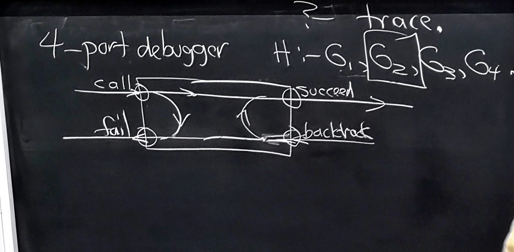
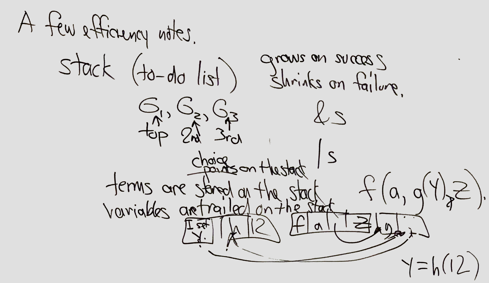
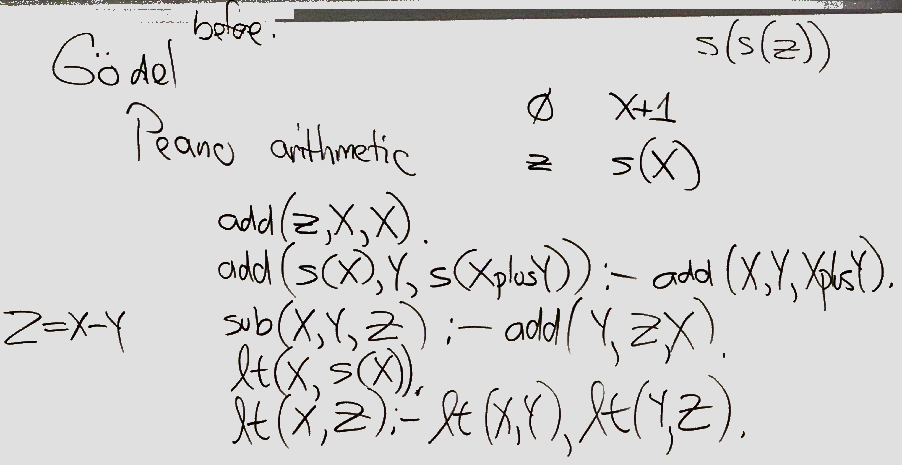
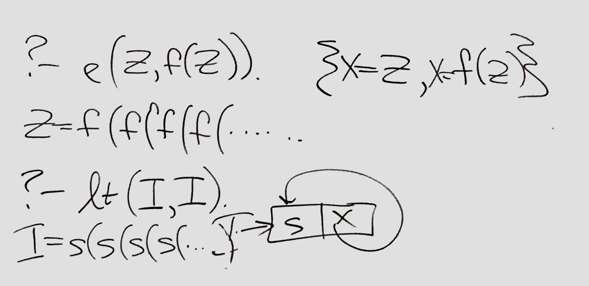
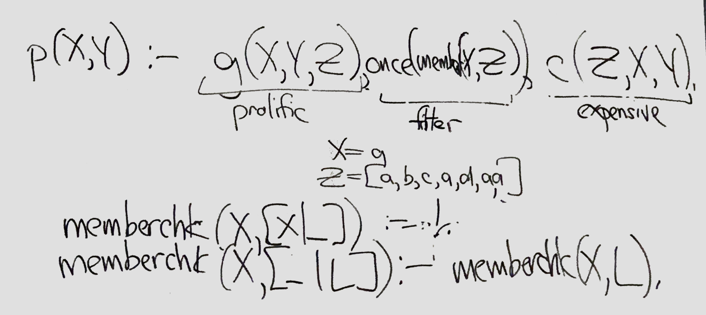

#Feb 19
## Prolog Cont.

```Prolog
    reverse([],[]).
    reverse([X|L], R):- reverse(L, Rev_L), append(Rev_L, [X], R).

    revapp([], A, A).
    revapp([X|L], A, R):- revapp(L, [X|A], R).
    reverse(L,R):- revapp(L, [], R).

    ?- append(X,Y, [a,b,c]), write(X+Y), nl, fail.
        []+[a,b,c]
        [a]+[b,c]
        [a,b]+[c]
        [a,b,c]+[]
        no
    % it fail at every attempt, thus, the append will try all the possible of append.

    ?- append(X,Y, [a,b,c]), write(X+Y), nl, !, fail.
        []+[a,b,c]
        no
    % it fail at every attempt, but since we put a cut !, it would not backtrack, and only write one time.
```

* **4 port debugger ```?- trace```**
    * 

* A few efficiency notes.
    * stack(to-do-list)
        * G1(top), G2(2nd), G3(3rd).
    * go on success, shrinks on failure.
    * term are steered on the stack
    * variables are trailed on the stack
    * 
* **peano arithmetic**
    * 

* **Infinite loop**
    * 


* **Unification**
    * Like Ocaml "match" but its two-way.

    ```prolog
        once(P):- P,!.
        \+ (P):- P,!,fail. %like not(P)
        \+(_).

        ?- X=4, \+(X=3).
            X=4
        ?- \+(X=3)， X=4.
            no

        % Note: 'not'=='\+' in prolog, but 'not' is a bad terminology.
    ```
    * 

