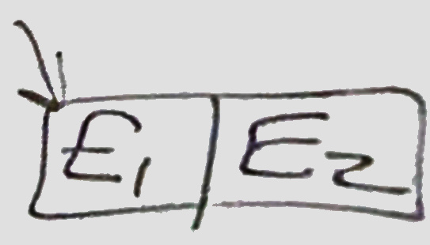
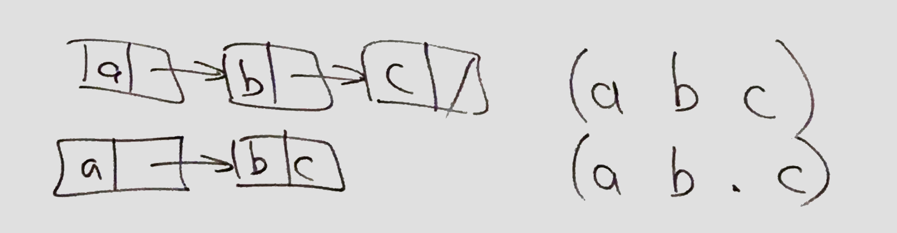
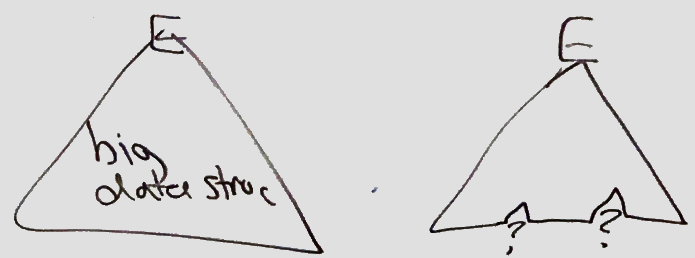
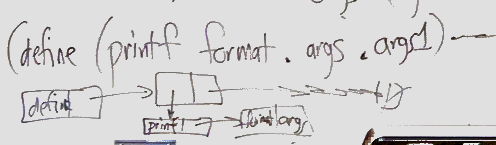
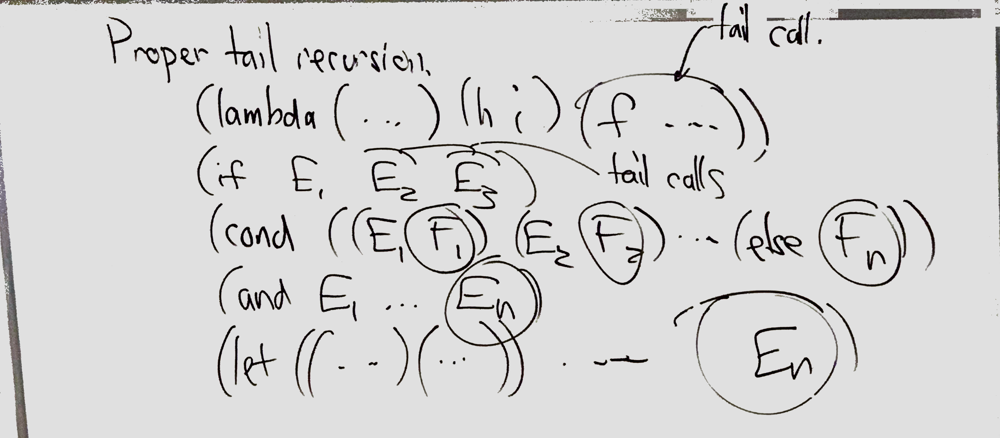
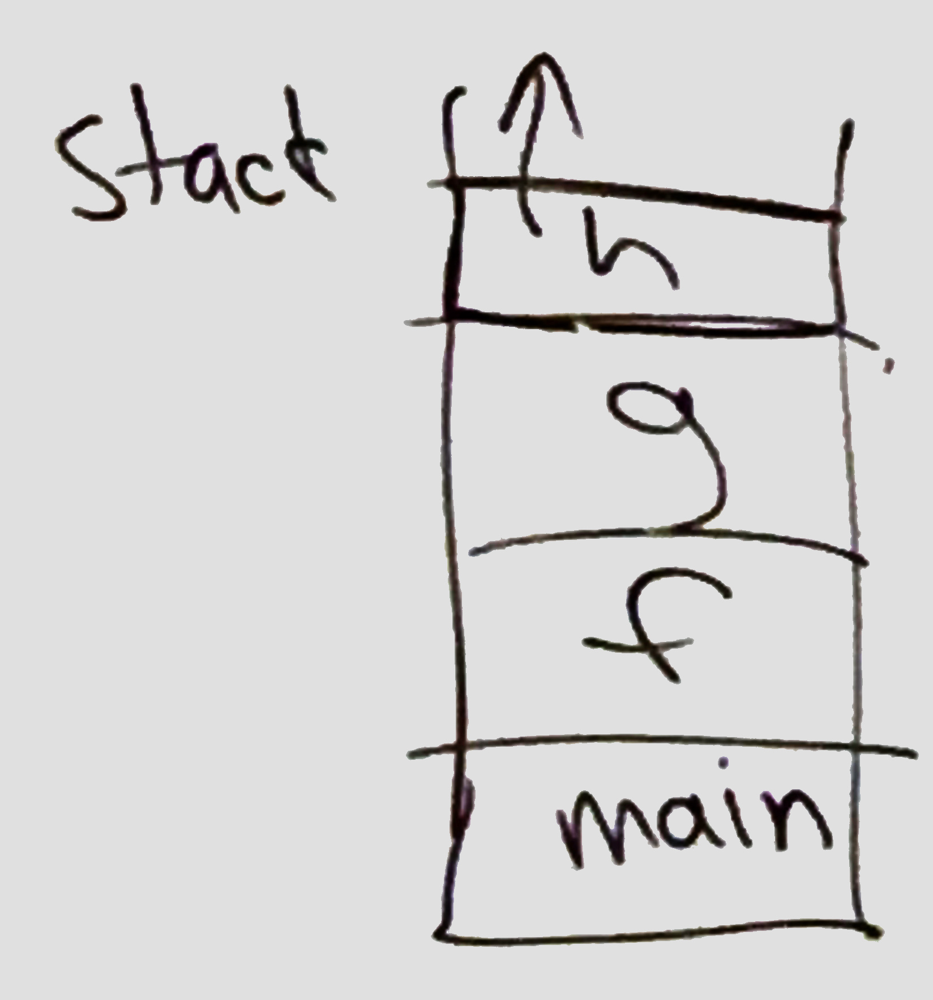
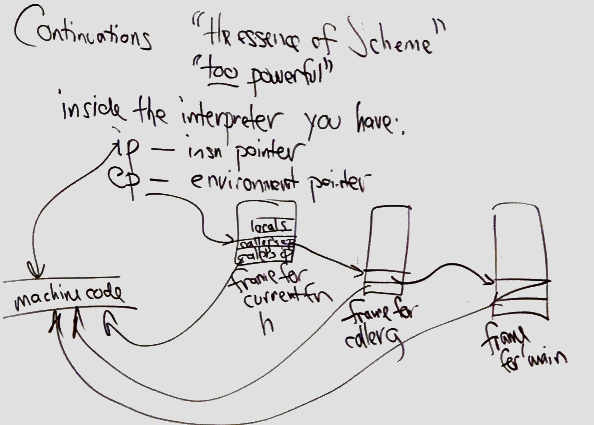
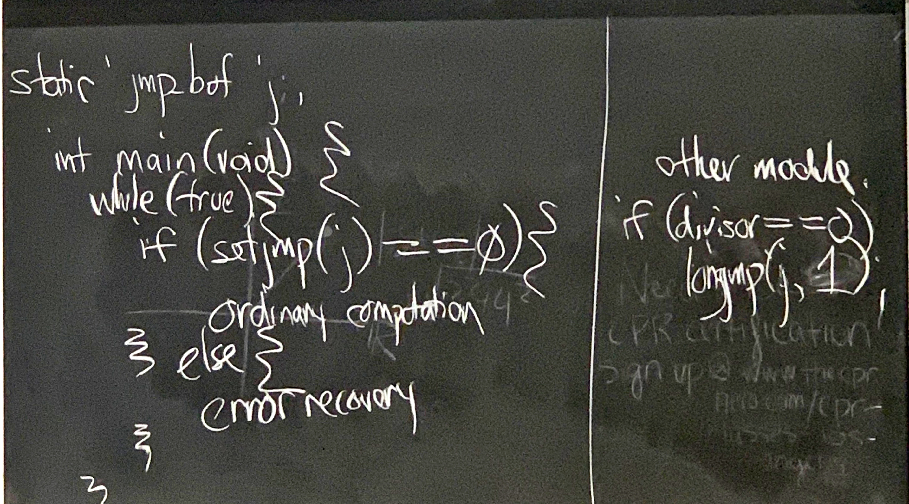

# Feb 24

## Scheme

* **Scheme vs. Lisp**
    * Scheme
        * S-expression
        * tail recursion
        * continuations

    * Lisp
        * AI Technology
        * PL history, Fortran(first high level language), Scheme(2nd, high-level language)
        * Simpler: minimal set of basic feature
        * orthogonal
    
* **Distinguishing characteristics of Scheme**
    1. objects are dynamically(heap) allocated and never freed (garbage collector).

    2. types are **latent**(properties of runtime object), **not manifest** (properties of parts of program)

    3. static scoping
        * (note: lisp is dynamic scoping)
        *  (Environment variable in shell) 
            ```shell
            PATH=/usr/bini/bin
            export PATH
            ```

    4. call by value
        *  caller has responsibility to check whether arguments are value, and then callee get a copy of arguments 

    5. All value are objects, and this includes functions & continuations

    6. very simple syntax, with a straight forward representation at programs as data.

    7. **TRO (tail recursion optimization)** is required.
        * when it call a function, it jump to the function directly.
            * in assembly code, it use ```jump``` instead of ```call```
        * stack size would not increase(won't overflow) as in other language like C and java.
        * ex: while loop
            ```scheme
            (while (< i n)     ;don't use keyword "while"!!!
                (set i (+ 1 i))) 
            ```
    
    8. arithmetic "works"
        * (```1/3``` return ```1/3``` directly)
        * no integer overflow
        * rational arithmetic
        * multiprecision arithmetic
        * support float -> complex number
    
* **Pairs and the empty list**
    * ```'()``` in your program evaluates to ```()```, the textual representation of empty list
        * ```'()``` == ```(quote ())```

* **scheme syntax**
    * **identifers**
        * ```a-zA-Z0-9_/*=<>```...
        * expect
            * cannot start with ```0-9``` ```+``` ```-``` ```.``` except ```+``` ```-```  ```...```

    * **numbers**
        * ```1/10``` is a rational number instead of a complex number
    
    * **pairs**
        * ```(E1 . E2) ```
            * 
    
    * **empty list** ```()```

    * **lists**
        * ```'(1 i s t s)```
        * improper list ```'(1 i s t . s)```
        * 
    
    * **strings** ```"abc\n"```

    * **booleans** ```#t``` ```#f```
        * ```#f``` is th only false in scheme
    
    * **quote (data)**
      * Quotes evaluates the expression as a data
      * ```'x``` ```'(y z)```
      * special form
          * ```(quote E)```yields E without evaluating it.
          * ```'x``` == ```(quote x)```
          * ```'(y z)``` == ```(quote (y z))```
              * ```quote``` is a keyword, not a function

        * number in scheme is "self-quoting"

    * **quasiquote** 
      * ``` `(x,y)``` == ```(quasiquote(x (unquote y)))```
      * 
  
      ```scheme
         > (quasiquote (1 2 (unquote (+ 1 2)) (unquote (- 5 1))))
          '(1 2 3 4) 
      ```
    
  * **```eval```**
    * The eval function takes a representation of an expression or definition (as a “quoted” form) and **evaluates** it.
    * **Negates quote**
    * Takes a list and treats it like a program
    ```scheme
    > (eval '(+ 1 2))
    3

    (define (eval-formula formula)
        (eval `(let ([x 2]
                     [y 3])
                 , formula)))

    > (eval-formula '(+ x y))
    5

    > (eval-formula '(+ (* x y) y))
    9
    ``` 
            

* **```cons car cdr```**
  * ```cons```
    *  is used for pairs, used to construct a list.
    *  
    ```scheme
    > (cons 0 3)    ;used for pairs
        '(0 . 3)
    > (cons 3 (cons y (cons 5 '())))    ; used to construct a list, list end with a null '()
        '(3 y 5)
    > (list 3 y 5)
        '(3 y 5)
    
    > (car '(3)) ;head of list
        3
    > (cdr (list 1 2 3)) ;tail of list
    '(2 3)

    > (cadr '(1 2 3 4)) ;"car of cdr", 2nd element of list
     2

    > (caddr '(1 2 3 4)) ;"car of cdr of cdr", 3nd element of list
     3
    ```

* **list operation**
  ```scheme
  (length (list 1 2 3)) -> 3            ;count num of element
  (list-ref (list 1 2 3) 1) -> 2        ;extract by index
  (append(list 1 2)(list 3)) -> '(1 2 3);append to list
  (reverse (list 1 2 3)) -> '(3 2 1)    ;reverse the list
  (member 4 (list 1 2 3)) -> #f         ; check if element is in list

  (map sqrt (list 1 4 9 16)) -> '(1 2 3 4)
  (andmap string? (list "a" "b" 1)) -> #f
  (ormap string? (list "a" "b" 1)) -> #t
  (filter string? (list "a" "b" 1 2)) -> '("a" "b")

  (null? '()) -> #t
  (empty? '()) -> #t
  ``` 
* **```cond```**
  * ```Cond``` supports any number of condition branches, and an optional else branch.
  * evaluates the condition on the left side of each branch, and stops at the first one that evaluates as true (precisely, the first one that’s not ```#f```). 
  * Then it evaluates the right side of the branch.
  * • If no branches match, you get ```<#void>```
  ``` scheme
    > (cond
        [(= 2 3) (error "wrong!")]
        [(= 2 2) 'ok])
    'ok

    > (cond
        [(= 2 3) (error "wrong!")]
        [else 'ok])
    'ok
  ``` 
* **function**
    ```scheme
    (define foo
        (lambda (x) (+ x 1)))
        ;(lambda (x) (+ x 1))
        ;(+ x 1) is call
    
    (define (foo x) (+ x 1)) ;syntax sugar
    
    foo(19) ;valid
    foo(19 20) ;invalid, too much args
    foo() ;invalid, too few args

    (define list (lambda x x)) ; input a list and return it directly
    (define (list . x) x)   ; syntax sugar
                            ; there is a "dot" "."  because x is a list
    ```
    * **variadic function**
    ``` scheme
        (define q (lambda args (cons 27 args)))
        (define (q . args) (cons 27 args))

        (define printf 
            (lambda(format . args) ... ))
        ; format is a stirng
        ; args is a list of args 2, 3, 4 ...

        (define (printf format . args) ...) ; syntax sugar

        (printf "hello %s %d\n" "joe" 19)
        ; format: printf "hello %s %d\n"
        ; args = ("joe" 19)

    ```
    * 

* **macro**
    * **```and```**
        ```(and E1 E2 ... En)```
        * if one of  ```E``` is false, return ```#f```
        * else return ```En```
        ```scheme
        > (and)
        #t

        (and E1 E2) ;syntax sugar of belows
        (if E1 E2 #f) 

        (and E1 E2 E3) ;syntax sugar of belows
        (if E1 (if E2 E3 #f) #f)
        ```
    
    * **```or```**
        ```(or E1 E2 ... En)```
        * return the first ```E``` that is true
        * else return ```En```
        ```scheme
        > (or)
        #f

        (or E1 E2) ;syntax sugar of belows
        (let ((v E1))
            (if v v E2))

        (or (getlenv 'PATH') "/usr/bins/bin")

        (if (getlenv 'PATH') (getlen 'PATH') "/usr/bins/bin")

        (let ((v (getlenv 'PATH')))
            (if v v "/usr/bins/bin")) ;this evluate getlenv only once
        ```

    * **```let```**
      * Used to create local bindings. 
      * The bindings of let are only available in the body of let but not in the clauses.
      * ```letrec``` lets you define recursive functions  
        ```scheme
        (let ((v E) (w F) (x G))
            (f v w x))

        (define foo 
            (lambda (v w x) (f v w x)))
        (foo E F G)

        ;is let is a syntax sugar for lamjhbda and binding value
        ```

* **hygenic macros**
    ```scheme
    (let ((v 19))
        (or #f v))

    ; if we replace it as above def. it will be wrong
    (let ((v 19))
        (let ((v #f))
            (if v v v))) 

    ; instead scheme will interpret it in this way, to keep the scope
    (let ((v2 19))
        (or #f v2))

    (let ((v2 19))
        (let ((v1 #f))
            (if v1 v1 v2))) 
    ```


------------
# Feb 26

* **Tail recursive**
    ``` scheme
    (define (reverse ls1) 
        (let revapp ((ls2 ls1) (a '())) ;"named let"; ravapp has 2 parameters; the top level args are ls1 and '()
            (if (null? ls2) 
                (append a'())
                (revapp (cdr ls2) ;a tail call, jmp instruction
                        (cons (car ls2) a))) 
        ))
    ```
    * 

* **Continuations**
    * "The essence of scheme"
    * "too powerful"
    * inside the interpreter, you have:
        * **ip** --instruction pointer -> pointer on machine code
        * **ep** --environment pointer -> pointer on local frame for current function
        * 
        * 

    * **how to create continuation**
        * **```(call-with-current-continuation p)```**
            * **```(call/cc p)```** -> can return multiple times
            
            1. create ```continuation k``` -> ```[ip|ep]``` pair
            2. (```p k)```
    * **to use a continuation**
        * you call it with a single argument.
        * ```(k v)```
            * set ```ip``` to ```k```'s ```ip```, and ```ep``` to ```k```'s ```ep```
            * arranges for ```call/cc`` to return v

        ```scheme
        (define (prod ls)
            (call/cc (lambda (break) 
            (let pr ((ls ls))
                    (cond   ((null? ls) 1)
                            ((zero? (car ls) (break 0)))
                            (else (* (pr(cdr ls))  (car ls)))
                    ))
            )))
        ```
        * there is similar operation in C
            * def
                ```C
                #include<setjmp.h>
                
                jmp_buf f;
                //jmp_buf array "f" "that holds ip,ep,...

                int setjmp(jmp_buf env);
                    //create continuation, store it into env; return 0

                _Noreturn void longjmp(jmp_buf env, int value)
                //restore interpreter registers from env
                //causes longjmp to return value(value != 0)
                ```
            * how to use it 
                * 
            


* **"Green thread"**
    * ""coroutines""
    ```scheme
    (define gtl '())

    (define (gt thunk) ;thunk -> parameterless procedure, executed for eide effect
        (set! gtl (append gtl (list thunk))))
    
    (define (start) 
        (let ((ft (car gtl)))
            (set! gtl (cdr gtl))
            (ft)))

    (define (yield)
        (call/cc (k)
            (get (lambda () (k 42)))
        (start)))

    ;;how to use it
    (gt (lambda () (let f () (display "h") (yield)(f))))
    (gt (lambda () (let f () (display "i") (yield) (f))))
    (gt (lambda () (let f () (newline) (yield) (f))))

    (start)

    >hi
    >hi
    >hi
    >...
    ```

* **continuation passing style**
    * apply continuation without ```call/cc```
    * every function accepts an extra arg ```k```(continuation) to return a value ```v``` => ```(k v)```

    ```scheme
    (define (prod ls break)
        (let pr ((ls ls) (k break)
            (cond   ((null? ls) (k 1))
                    ((zero? (car ls)) (break 0))
                    (else (pr (car ls) (lambda (v) (* v(car ls)))))
            ))))
    ```

* **Object-oriented style in C**
    * every function accepts an extra arg (object this method is being invoked on)

--------
* **Error in Scheme programs**
    * undefined behavior: ```(car 0)```
    * an error is signaled (open-input-file "foo")
        * implementation must check for the error and report
    * Unspecified behavior
        * ```(eq? '(a b) '(a b))```
            * two implementations
                * refers to two different list ->```#f```
                * refers to the same list -> ```#t```
    * implementation restriction
        * memory exhaustion: ```(con 3 4)```
