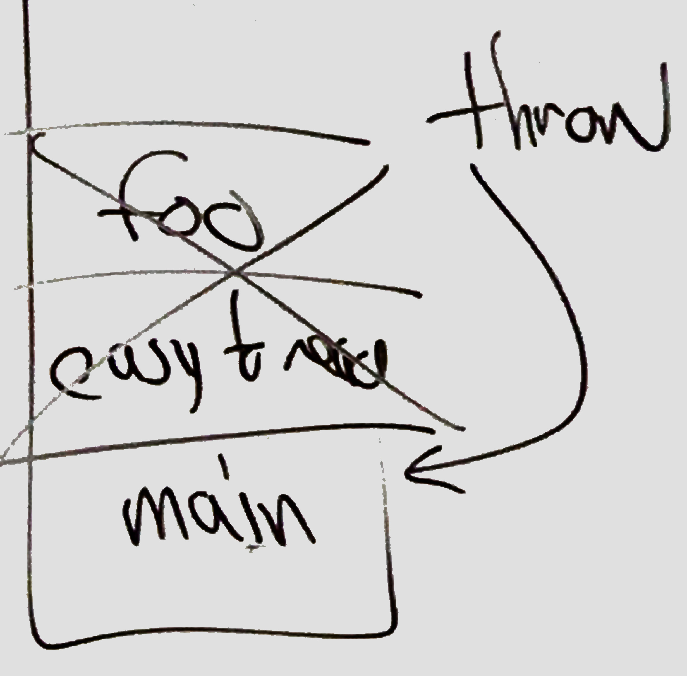
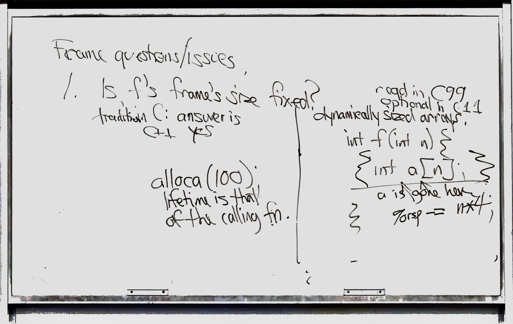
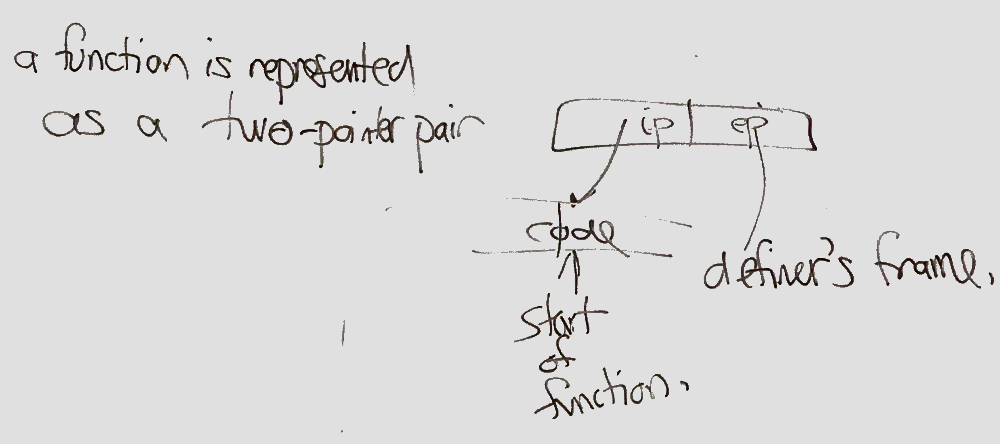
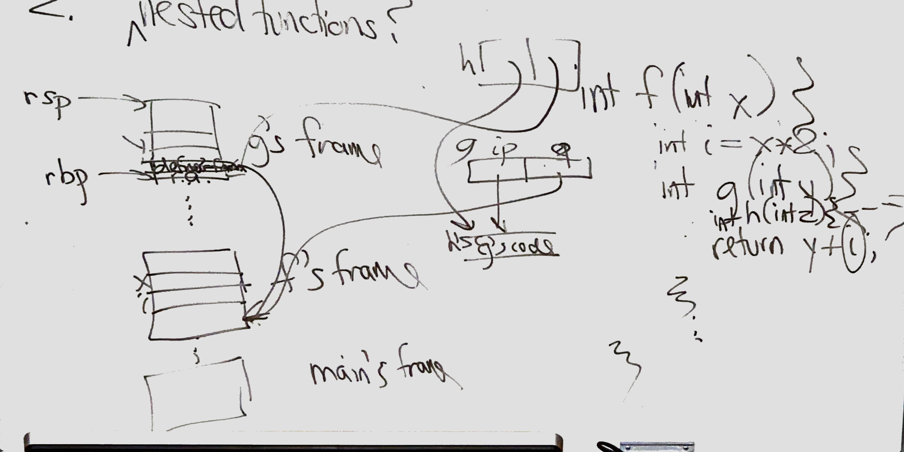
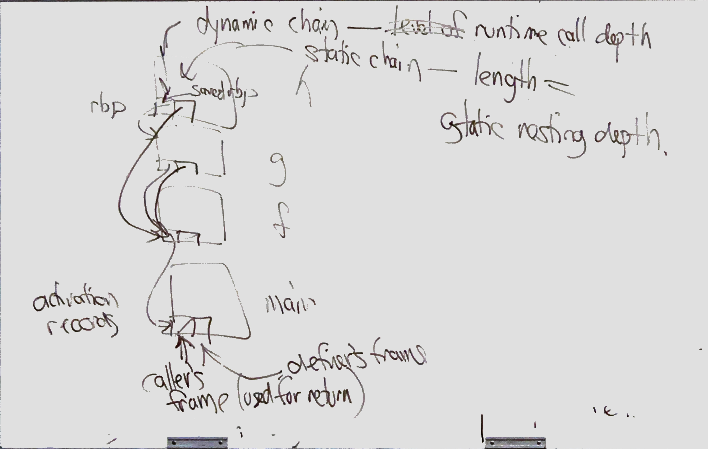
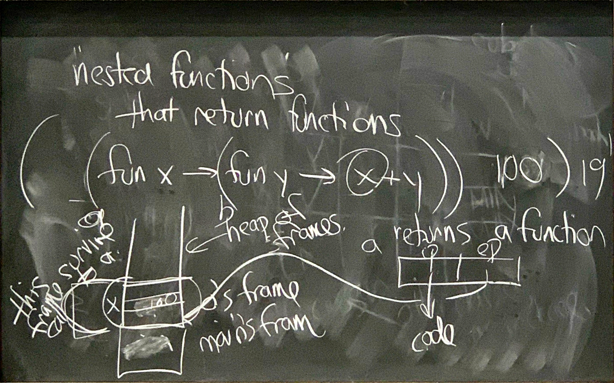
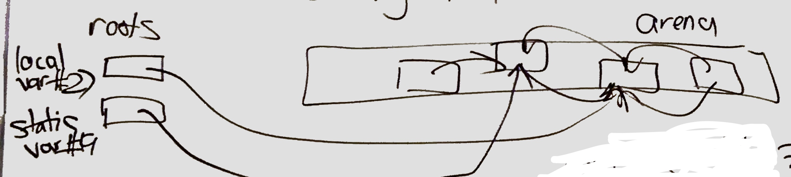
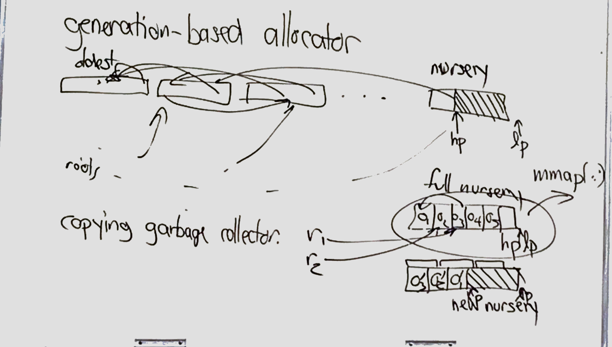
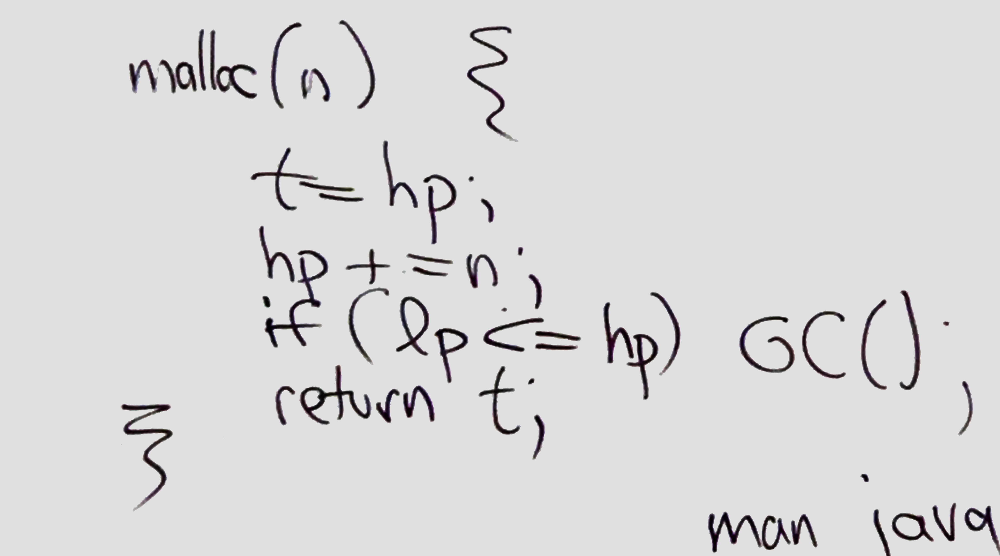

# Mar 2
###Error Handling
* **Compile-time Checks**
    * a.k.a **Static checks** 
    * at Link time
    * C++, Java
    * dereferencing ```null`` is a runtime error in C++ and Java
    * Ocaml -> statically

* Precondition
    * Obligation on caller ```divide(i,j)```
        * ```(j != 0) && !(i == INT_MIN && J == -1)```
    * Prat of API
    * Eiffel

* **Local Definition**
    * (e.g. ```IEEE float```)(special values of ```INF``` ```NaN```)
* **Fatal errors**
    * ```abort()```

* **Exception handling**
    ```java
    try{    //ordinary case
        nice = simple(node);
        easy_to_read();

    }catch(IOError e){     //unusual case
        System.out.println("IOError" + e.toString())
    }finally{   
        ...
        //cleanup code, 
        //this part away be executed(no matter exception or not)
    }

    try{
        code(),
    }catch(IOError e){} //bad style

    easy_to_read(){ foo(b);}
    foo(int b)
    { throw IOError(47); /*trigger error manually*/}
    ```
    * 

* **alternative**
    * Unix/POsIX system calls
    * Every function return a success status
    * Every caller decides whether to reflect the failure to its caller or to handle it


### **Scope & visibility**
* scope of name = set of program locations where that name is visible
* visibility and existence is different things

* **block structure Scope**
    ```C
    {
        //-scope of first a start here
        int a = 27;
        {   //-scope of second a start here
            float a = 0.5; 
            print(a);// print 0.5
            //-scope of second a end here
        }
        print(a);// print 27
        //-scope of first a end here
    }
    ```

* **Namespace**
    * Namespace = partial function from name to values
    * ad hoc namespaces
        ```C++
        int main(void){
            int f; //ordinary type
            struct f{double f;}; //struct type and ordinary type are not sharing the same namespace
            goto f;
            class f{...};

            #define f g //this may have trouble
        }
        ```
    * Every class get its own namespace in C++, Java, OCaml...
    * Which or there names are visible to outsiders?
        1. Mark each name with a visibility modifier (eg. ```public```, ```private```)
        2. Derive "sanitized" namespace from original namespaces (via separate definition)

    |     *     | Same class | Other classes in same package | Subclass | Outside package(Everybody else) |
    |:---------:|:----------:|:-----------------------------:|:------------------------:|:--------------:|
    |   public  |     yes    |              yes              |            yes           |       yes      |
    | protected |     yes    |              yes              |            yes           |                |
    | (default) |     yes    |              yes              |                          |                |
    |  private  |     yes    |                               |                          |                |

### Storage management
* **what program constructs**
    * (these can be cashed into machine register)
    * variables
        * static - one instance address knows statically
        * automatic - one per runtime function call
        * instance - one per object 
    * return addresses
    * complier temporaries
    * `new()`/`malloc()`
    * I/O Buffer
    * code(insns)
* **Types of Allocation**
    * **static allocation**
        * allocate the program and static variable
        * pro:
            * simple
            * cannot exhaust memory while running
        * con:
            * doesn't work well if problem size is unpredictable

    * **stack allocation** (FIFO)
        * used for automatic variable
        * pro:
            * recursion
            * allocate just enough stack space
    
    * **heap allocation** (NON-FIFO)
        * pro: flexibility
        * con: free is a pain

    * **Persistent allocation**
        * variable survives until program exist

* **Stack allocation via Activation Record(AR) or frame**


* **Frame question/issues**
    1.  **Is `f`'s frame's size fixed?**
        * transitionally in C/C++, the answer is yes
        * dynamically sized array
         * 
    2. **statically nested function?**
        * 
        *
        * 
        *
        * 
        *
        * 

-------
### Mar4 

* **Heap Management**
    * 
    * instead of using a extra list to store the free memory location(as below), it store the free memory area detail inside the free area(as above).
    * it store the size of free memory, the location of next free memory area
    * `void *malloc(size.t n)`
        * go through the free list, find the first area that is large enough.
            * **problem**, it will have bunch of small free blocks, and slow down the `malloc` function
            * **solution**: make the list circular(roving list)
                * fixed vs. roving list

    * `void free(void *p)`
        * free are coalescing free blocks(to solve fragmentation problem)
        * put a flag at the head and tail of block to indicate whether it is free ot occupied

    * For lisp, everything is pointer, so each element hold two pointers. and every cons has the same size `(cons p1 p2)` lisp's cons is used to append an element to a list and list is allocated in contiguous blocks in memory, so it solved the fagmentation problem


    * **quick list**
        * a way to improve the heap's performance
        * for a Scheme interpreter, you know that a lot of allocations will be for 
        ```C
        struct cons {void *car, *cdr;}; //16 btes in X86-64
        static struct cons* ql;

        struct cons' *cons(void *a, void *b)
        {
            if(ql){
                void *nql = ql->cdr;
                ql->car = a;
                ql->cdr=b;
                void *r = ql;
                ql = nql;
                return r; 
            }
            else{
                struct cons *r = malloc(sizeof *r);
                r->car = a;
                r->cdr = b;
                return r;
            }
        }
        ```

|          Parameter          |                                                            Stack                                                            |                   Heap                   |
|:---------------------------:|:---------------------------------------------------------------------------------------------------------------------------:|:----------------------------------------:|
|            Basic            |                                          Memory is allocated in a contiguous block.                                         | Memory is allocated in any random order. |
| Allocation and Deallocation | Automatic by compiler instructions. Allocation happens in function call stack. Deallocation happens in function call is over. |           Manual by programmer.          |
|             Cost            |                                                             Less                                                            |                   More                   |
|        Implementation       |                                                             Hard                                                            |                   Easy                   |
| Access time                 | Faster                                                                                                                      | Slower                                   |
| Main Issue                  | Shortage of memory                                                                                                           | Memory fragmentation                     |
| Locality of reference       | Excellent                                                                                                                   | Adequate                                 |
| Flexibility                 | Fixed size                                                                                                                  | resizing is possible                      |
###Garbage collection
* **explicit free vs. garbage collection**
        * garbage collection
            * pro:
                * simpler
                * dangling references avoided
                    *free a `Null` ptr.
                * (some) exhaustion avoided.
            * con:
                * complexity
                    * bugs
                    * multi-threaded
                * performance
                    * hiccup during GC
                    * overhead(CPU+Memory)

* **Classic G.C. algorithm**
    * 
    * **mark and sweep**
        * Mark parse
            1. clear all mark bits
            2. find all object immediately reachable from the root and mark them.
            3. find all unmarked objects immediately reachable from marked objects and mark them.
        * Sweep parse
            4. add all unmarked object to free list.
        * **BFS or DFS**
        * cost --> total # of object, could be expensive and have hiccup.

* **Real-time G.C.**
    * upper bound to the CPU time needed to `new C()`, "every call to `new()` does a little bit of mark & sweep"

* **Put G.C. in its own thread.**
* **How to know where the roots are?**
    1. complier tell the G.C. location of roots + object layout
        * used in Java and OCaml, but not C++/C(complier don't do this)
        * object are movable (Java has no pointer, it reference object directly, so it is movable)
    2. GCC
        * it has `#define free(p)`
        * build in conservative G.C.
        * you(memory management) knows where the objects are, where stack + stack storage registers are.
            * look for words that **might** be pointers.
            * so you won't deference dangling pointer(cuz it's danger), you may leak storage.
        * object are immovable (C use pointer to reference the object, and moving the pointer is ricky)

* **Generation-based allocator**
    * 
    * 


* **Copying garbage collector**
    * bad when we using quick list, cuz it copy entire list when it see it.(although there are garbage memory)
    * when using multi-thread, each thread has its own nursery


* `o.finalize()`
    * good for mark + sweep


* **Python memory management**
    * use **reference counter**
        * each object keep a reference counter (# of pointers to this object)
            * if reference counter = 0, add to free list(garbage collection)
    * drawback
        * slow down pointer assignment
        * **circularity pointing problem**
    * new approach, when memory slow, it go to mark and sweep
------------

# OO Language
* lots of variations
    * static vs. dynamic type-checking
        * python is dynamic type-checking lang

* class based vs. prototype based
    * class based
        ```python
        o = new C()
        p = o.clone()
        ```
    * prototype based
        ```python
        p = o.clone()
        gthread = thread.clone()
        gthread.newMethod("m",....)
        ```