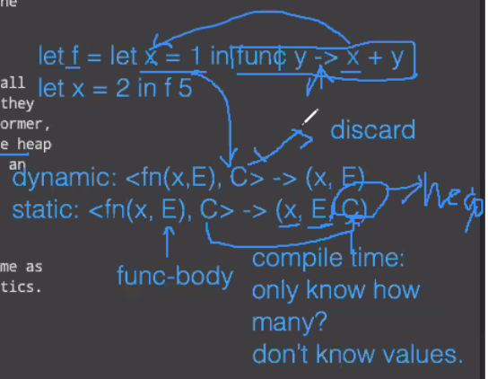

1. For lisp, everything is pointer, so each element hold two pointers. and every cons has the same size `(cons p1 p2)` lisp's cons is used to append an element to a list and list is allocated in contiguous blocks in memory, so it solved the fagmentation problem

2. 1
   1. 2a
      1. s: int -> int
      2. i: int-> int -> int list
      3. f: ('b -> bool)->'b list->'b list //this work as a pointer
      4. x: int -> int list -> int list //filter out items not divisible by n
      5. 
         1. f1 int list -> int list
         2. t: int -> int list //sieve for prime number
   2. []

5. 1
   1. * 
   2. 5a
      1. heap is more efficient than stack in this case
      2. because the variables can be stored in heap as context and we only need to pass the pointer to the callee
         1. (Body, context)  2 pointers
         2. (Body, [x=1, ….])
      3. and we cannot point to stack (keep the variable in func-body and pass it is terrible idea)
   3. 5b
      1. we dont have the c, so there is no need for heap
6. 1
   1. Side note
      1. Call by value: evaluate argument -> call function
      2. Call by name: pass the expression of arg to func-> evaluate when needed
      3. Call by need: call-by-name + caches(every arg is only evaluated once)
      4. Call by value and call by name has sid-effect
      5. pure-functional to avoid differences
   2. incomplete go back and check video: 1:25

7. 1
   1. 7a
        ```Prolog
        shift([_|Rest], Rest)
        ``` 

9. q9
   1.  `let` and `cond` are macros
       1.  Read-prerocesses(macro expansion, ex by `eval`, done at run time)- Evaluate
   2.  `(1)` is invalid because `1` is not a function

10. python is dynamic but we can do
  ```python
  def plus(a: int, b: int) -> int: return a + b
  #but we still can do
  plus("a", "b") # it wll throw a warning
  ```
