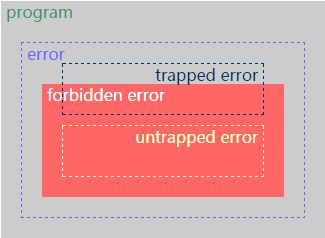

* **Program Errors**
    * **trapped errors** 导致程序终止执行，如除0，Java中数组越界访问
    * **untrapped errors** 出错后继续执行，但可能出现任意行为。如C里的缓冲区溢出、Jump到错误地址
* **Forbidden Behaviors**
    * 语言设计时，可以定义一组forbidden behaviors. 它必须包括所有untrapped errors, 但可能包含trapped errors.
* **Well Behaved vs. ill Behaved**
    * **well behaved**: 如果程序执行不可能出现forbidden behaviors, 则为well behaved。
    * **ill behaved**: 否则为ill behaved...

#### 强、弱类型
* **强类型strongly typed**: 如果一种语言的所有程序都是well behaved——即不可能出现forbidden behaviors，则该语言为strongly typed。
* **弱类型weakly typed**: 否则为weakly typed。比如C语言的缓冲区溢出，属于trapped errors，即属于forbidden behaviors..故C是弱类型
    * 弱类型语言，类型检查更不严格，如偏向于容忍隐式类型转换。譬如说C语言的int可以变成double。 这样的结果是：容易产生forbidden behaviors，所以是弱类型的

#### 动态、静态类型 (complier behavior)
* **静态类型 statically checked**: 如果在编译时拒绝ill behaved程序，则是statically typed;
* **动态类型dynamically checked**: 如果在运行时拒绝ill behaviors, 则是dynamically typed

#### 误区
* 大家觉得C语言要写int a, int b之类的，Python不用写(可以直接写a, b)，所以C是静态，Python是动态。这么理解是不够准确的。譬如Ocaml是静态类型的，但是也可以不用明确地写出来。

#### 静态类型可以分为两种：
* 如果类型是语言语法的一部分，在是**explicitly typed显式类型**；
* 如果类型通过编译时推导，是**implicitly typed隐式类型**, 比如ML和Haskell

#### ex:
* 无类型： 汇编
* 弱类型、静态类型 ： C/C++
* 弱类型、动态类型检查： Perl/PHP
* 强类型、静态类型检查 ：Java/C#
* 强类型、动态类型检查 ：Python, Scheme
* 静态显式类型 ：Java/C
* 静态隐式类型 ：Ocaml, Haskell

###
*  

* 红色区域外：well behaved （type soundness）
* 红色区域内：ill behaved
* 如果所有程序都是灰的，strongly typed
* 否则如果存在红色的程序，weakly typed
* 编译时排除红色程序，statically typed
* 运行时排除红色程序，dynamically typed
* 所有程序都在黄框以外，type safe

* **Trapped error**: An execution error that immediately results in a fault.
* **Untrapped error**: An execution error that does not immediately result in a fault.
* **Forbidden error** : The occurrence of one of a predetermined class of execution errors; Typically the improper application of an operation to a value, such as not(3).
* **Well behaved**: A program fragment that will not produce forbidden errors at run time.
* **Strongly checked language**: A language where no forbidden errors can occur at run time (depending on the definition of forbidden error).
* **Weakly checked language**: A language that is statically checked but provides no clear guarantee of absence of execution errors.
* **Statically checked language**: A language where good behavior is determined before execution.
* **Dynamically checked language**: A language where good behavior is enforced during execution.
* **Type safety**: The property stating that programs do not cause untrapped errors.
* **Explicitly typed language**: A typed language where types are part of the syntax.
* **Implicitly typed language**: A typed language where types are not part of the syntax.
