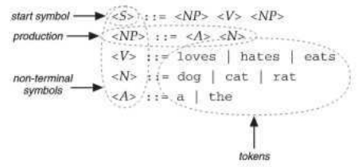
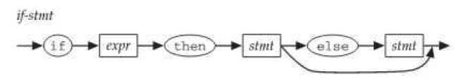

##### 1.2
* Imperative Language 命令式语言
  * Assignment
  * Iteration
  * ex: C
    ```c
        int fact (int n) {
            int sofar = 1;
            while ( n > 0 ) sofar *= n--;
            return sofar;
        }
        ```

* Functional Languages 函数式语言
  * Recursion
  * Single-valued variables
  * ex: ML & Lisp
    ```ML
        fun fact x -
            if x <= 0 then 1 else x * fact ( x - 1);
    ```

    ```Lisp
        (defun fact (x)
            (if (<= x 0) 1 (* x (fact (- x 1)))))
    ```

* Logic Programming Languages 逻辑式语言
  * Expressing a program in terms of rules about logical inference.
  * ex：Prolog
    ```prolog
        fact (X,1) :-
        X =:= 1,
        !.
        fact (X,Fact) :-
        X > 1,
        NewX is X - 1,
        fact(NewX, NF),
        Fact is X * NF.
    ```
  
* Object-Oriented Languages
  * Ex: Java
  ```java
    public class MyInt {
        private int value;
        public MyInt (int value) {
        this.value = value;
        public int getValue(){
        return value;
        )
        public MyInt getFact() {
        return new MyInt(fact(value));
        }
        private int fact(int n){
        int sofar = l;
        while (n > 1) sofar *= n--;
        return sofar;
        }
    }
  ```

* multi-paradigm Languages
  * Ex: JavaScript, OCaml, Python and Ruby
------------
##### 2.4
* A grammar has four parts:
  * the set of **Tokens**
  * the set of **non-terminal symbols**
  * the set of **productions**
  * **start symbol**

     
-----------
##### 2.5 writing grammar
* Ex
  ```java
    float a;
    bollean a,b,c;
    int a=1, b, c = 1+2; 
  ```
  ```BNF
  <var-dec> ::= <type-name> <declarator-list> ;
  <type-name>::= bollean | byte | short | int
                  | long | char | float | double 
  <declarator-list> ::= <declarator> | <declarator> , <declarator-list>
  <declarator> ::= <variable-name> | <variable-name> = <expr>

  Note: we might need to add [] for the case of array, and need parts of grammar to define
        legal variable name and legal expressions.
  ```
------------
##### 2.6 lexical structure and phase structure
* Grammars are usually store as a simple text file.
* **phase structure**
  * tokens are not individual characters, but meaningful chunks like names,
                        keywords and operator
  * a token-level grammar(specifying the phrase structure.) defines a program as a sequence of tokens.
<br />
* **lexical structure**
  * a character-level grammar(specifying the lexical structure.) defines a text file as a sequence of
     program elements like tokens and white space.
  * ex:
    ```
    <program-file> ::= <end-of-file> | <element> <program-file>
    <element> ::= <token> | <one-white-space> | <comment>
    <one-white-space> ::= <space> | <tab> | <end-of-file>
    <token> ::= <name> | <operator> | <constant> | ...
    ...
    ```

* **scanner(or lexer)** 
  * read input file and convert it to a stream of tokens, discarding the while space and comment.
* **parser** reads the steams of tokens and form the parse-tree.

--------
##### 2.7
* **BNF**
  * <,>,| or ::= might be the metasymbols of grammar.  

  <br/>
* **EBNF**
  * Any grammar syntax that extend BNF is called  an EBNF.
  * Ex:
    ```
    * [ something ] in the right-hand side of a production means that something inside is optional.
    * { something } or *something in the right-hand side of a production means that something inside can be repeated by any number of times(zero or more)
    * Parentheses are used to group things on the right-hand side so that |, [], and {} can be used in the same production unambiguously.
    ```

* ex in EBNF
  ```
    * <if-stmt> ::= if <expr> then <stmt> [else <stmt>]
    * <stmt-list> ::= {<stmt> ;}
    * <thing-list> := { (<stmt> | <declaration>) ;}

    * <mystery1> ::= a[1]
      * the square brackets can be part of a single token (a single string a[1]) or metasymbols(two string: a or a1)
      * To distinguish them, add single quotes when it is part of token
        * <mystery1> ::= 'a[1]'
  ```

  * syntax diagrams
    * ex: <if-stmt> ::= if <expr> then <stmt> [else <stmt>]
         
  -------------
 